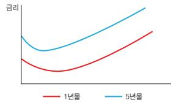
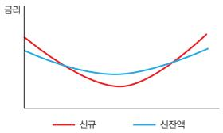

# 가계대출 상품설명서

■이 설명서는 금융소비자의 권익 보호 및 대출상품에 대한 이해 증진을 위하여「금융소비자 보호에 관한 법률」 및 관련 규정에 의거, 은행의 내부 통제절차를 거쳐 대출상품의 주요 내용을 쉽게 이해할 수 있도록 작성한 자료입니다.

■ 설명내용을 제대로 이해하지 못하였음에도 불구하고 설명을 이해했다는 서명을 하거나 녹취기록을 남기시는 경우, 추후 해당 내용과 관련한 권리구제가 어려울 수 있습니다.

## 고객님께서는 상품 가입 전 아래 사항을 반드시 확인·숙지하여 주시기 바랍니다

## ☑ 유사 상품과 구별되는 특징

- 가계대출은 가계가 생계유지 등 기타 사용목적으로 받는 대출상품을 총칭하며, 대표적으로 신용대출 상품이 있습니다.

- 신용대출은 고객님의 소득 등에 따라 평가되는 개인 신용도에 기반하여 대출한도 및 금리가 산정되는 대출상품입니다. 담보대출과 비교하여 별도의 담보를 요구하지 않으며, 절차가 상대적으로 간소화되어 있다는 특징을 지니나 일반적으로 금리수준이 높은 경우가 많아 동일한 금액을 신용대출로 이용하는 경우 이자비용 부담이 증가할 수 있습니다.

## ■민원·상담이 빈번하여 숙지가 필요한 사항

Q1.대출과 신용도는 어떤 관계가 있나요?

- 대출상품 이용 시, 대출계약의 체결만으로도 신용평점이 하락할 수 있으며, 신용평점 하락 시 대출 및 다른 금융회사와의 금융거래 등 이용에 불이익이 발생할 수 있습니다.

Q2. 모든 대출상품에 대해 금리인하요구가 가능한가요?

- 은행이 대출금리를 산정한 가계대출에 대하여만 신청 가능하며, 등급별 동일 가산금리를 적용받은 대출이나 별도 협약 등에 의해 결정된 금리가 적용되는 대출은 금리인하요구권 대상에서 제외됩니다.

Q3.여유자금이 생겨 대출금을 만기 전에 상환하고 싶은데 가능한가요?

- 대출금을 중도에 상환하는 경우 중도상환수수료가 부과될 수 있습니다. (예: 1억원을 중도상환할 경우, 최대 70만원 부과) 중도상환수수료는 대출의 잔여일수 및 상환금액에 따라 달라지며, 중도상환 시 향후 원리금 상환 부담금액이 감소하게 됩니다.

Q4.대출상품을 이용 시 부담해야 하는 비용은 무엇이 있나요?

- 대출을 이용하실 경우, 기본적으로 대출금과 이자에 대한 상환의무를 부담하시게 되며, 대출상품에 따라 인지세 등 추가적인 비용을 부담하실 수 있습니다.

Q5.대출금액은 신고한 자금용도로만 사용해야 하나요?

- 대출금을 당초 신고한 용도와 달리 사용할 경우, 즉시 상환해야 할 수 있습니다.

Q6.대출을 받은 후 금리를 인하하거나 대출을 철회 할 수 있나요?

- 금리인하요구권과 대출금 수령일로부터 14일 이내에 신청가능한 대출계약철회권이 있으며 각 권리를 요구 시일정한 요건이 충족되지 않으면 거절될 수 있습니다.

Q7.이자금액과 납입일은 어떻게 되나요?

변동금리, 고정금리, 혼합금리 등 방식에 따라 이자금액이 결정되며 금리 방식에 따라 이자부담이 증가할 수 있습니다. 납입일은 대출계약 체결시 약정한 지급시기와 방법에 따라 은행에 지급하셔야 합니다.(예 : 매월 15일 50만원을 대출계좌로 자동이체)

## 발생 가능한 불이익에 관한 사항

·대출금 연체 시 대출원금에 대한 연체이자 납부 및 연체정보 등록

(예: 대출원금이 1억, 연체이자율 연 9.6%인 경우 1억×9.6%×1/12=월 연체이자 80만원)

·기한의 이익 상실 ●변동금리 또는 고정금리 선택에 따른 차이 ●중도상환수수료 ●연체이자율 및 부과사유

·높은 담보인정비율 대출 또는 상장주식 담보대출 등 관련 담보가격 하락에 따른 추가 담보 요구

## 민원·상담·분쟁조정 연락처

- 당사 인터넷 홈페이지(www.kbstar.com) 또는 소비자지원부(02-2073-7900)로 문의하시기 바랍니다.

- 분쟁이 발생한 경우에는 금융감독원 e-금융민원센터(http://www.fcsc.kr) 또는 대표번호(국번없이 1332) 등에 도움을 요청하실 수 있습니다.

## 1 수수료 등 비용부담 사항

## □ 중도상환수수료 : 중도상환대출금액 × 중도상환수수료율(%) × (대출잔여일수 ÷ 대출기간)

중도상환수수료율은 이자기회비용 및 행정비용·모집비용 등 실비용 내에서 매년 재산정되며, 금리적용방식 및 담보구분에 따라 달리 적용됩니다. (2025.1.13일 이후 신청분에 대한 중도상환수수료율은 전국은행연합회 홈페이지에 고시됩니다.)

최초 대출취급일로부터 3년까지 적용합니다. 대출만기 도래 전 3개월 이내에 상환하는 경우에는 중도상환수수료가 부과되지 않습니다.

※ 중도상환수수료란 대출의 상환기일이 도래하기 전에 대출금을 상환할 경우 고객이 부담하는 금액입니다.

- 다만, 기존 대출 계약을 해지하고 동일 은행과 사실상 동일한 계약(기존 계약에 따라 지급된 금전 등을 상환받는 새로운 계약)을 체결한 경우, 양 계약의 유지기간을 합하여 3년이 경과한 후 해지할 경우에는 중도상환수수료가 면제됩니다.

• (예시) 1년 만기 신용대출을 받고나서 6개월 후 대출금 1억원을 상환할 경우 나에게 적용되는 중도상환수수료는?

(대출잔여일수=182일, 대출기간 1년=365일, 중도상환수수료=0.7% 가정)

 $$  중도상환대출금액 :1억원 \times0.7\%\times(182\div365)=349{,}041원 $$ 

## 인지세

※ 인지세란 인지세법에 의해 대출약정 체결시 납부하는 세금으로 대출금액에 따라 세액이 차등 적용됩니다.

<table border=1 style='margin: auto; width: max-content;'><tr><td colspan="2">대출금액</td><td style='text-align: center;'>5천만원 이하</td><td style='text-align: center;'>5천만원 초과 1억원 이하</td><td style='text-align: center;'>1억원 초과 10억원 이하</td><td style='text-align: center;'>10억원 초과</td></tr><tr><td style='text-align: center;'></td><td style='text-align: center;'>인지세액</td><td style='text-align: center;'>비과세</td><td style='text-align: center;'>7만원</td><td style='text-align: center;'>15만원</td><td style='text-align: center;'>35만원</td></tr><tr><td style='text-align: center;'></td><td style='text-align: center;'>고객 부담</td><td style='text-align: center;'>-</td><td style='text-align: center;'>3만 5천원</td><td style='text-align: center;'>7만 5천원</td><td style='text-align: center;'>17만 5천원</td></tr><tr><td style='text-align: center;'></td><td style='text-align: center;'>은행 부담</td><td style='text-align: center;'>-</td><td style='text-align: center;'>3만 5천원</td><td style='text-align: center;'>7만 5천원</td><td style='text-align: center;'>17만 5천원</td></tr></table>

## □고객이 부담하는 비용

<table border=1 style='margin: auto; width: max-content;'><tr><td style='text-align: center;'>구분</td><td style='text-align: center;'>부담하게 되는 금액</td></tr><tr><td style='text-align: center;'>기존 근저당권 설정등기의 감액/말소</td><td style='text-align: center;'>• 건당 비용 발생 (보통 건당 45,000원) • 부동산 갯수에 따라 금액 추가</td></tr><tr><td style='text-align: center;'>기존 근저당권 설정등기의 주소 변경</td><td style='text-align: center;'>• 1건 : 21,000원</td></tr><tr><td style='text-align: center;'>확인 서면 (등기필증이 없는 경우)</td><td style='text-align: center;'>• 법무사 보수료 15,000원</td></tr><tr><td style='text-align: center;'>국민주택채권 매입비용</td><td style='text-align: center;'>• 근저당 채권최고액의 1% • 즉시 매도하는 경우 비용 산식은 아래와 같습니다. 근저당 채권최고액의 1% × 일별 채권할인율(근저당권 설정접수일기준) 예시) &#x27;21.7.30일 기준(할인율 4.3753%) 1억원 설정시 43,750원 부담※ 상세 금액은 국민주택기금 홈페이지 등에서 확인 가능합니다.</td></tr></table>

## □은행이 부담하는 비용

※다만, 대출 신청 이후 고객에 의한 취소 또는 심사 과정상 취급 거절사유 발생 시에는 고객이 부담합니다.

<table border=1 style='margin: auto; width: max-content;'><tr><td style='text-align: center;'>구분</td><td style='text-align: center;'>부담하게 되는 금액</td></tr><tr><td style='text-align: center;'>근저당권 설정 신규 설정비용</td><td style='text-align: center;'>• 등록면허세 + 지방교육세 + 대법원증지 + 등기신청수수료 + 법무사수수료* 예시) 대출금액 2억(채권최고액 2.2억) 기준    등록세 40만원 + 교육세 8만원 + 대법원증지 1.5만원 + 등기신청수수료 1.6만원 + 법무사수수료 19.9만원 ≠ 71만원</td></tr><tr><td style='text-align: center;'>전입세대 열람 및 현장조사</td><td style='text-align: center;'>• 담보로 제공하는 부동산의 주소지에 따라 상이* 예시) 전입조사 + 현장조사 25,400원</td></tr><tr><td style='text-align: center;'>감정평가 시 감정평가 수수료</td><td style='text-align: center;'>• 담보로 제공하는 부동산의 종류, 주소지, 감정가격 등에 따라 상이* 예시) 서울 단독주택 감정가 9억 기준, 약 94만원(수수료 88.4만원 + 실비 5.6만원)</td></tr></table>

## 기타 수수료:고객이 부담

기타비용으로서 부담주체가 분명하지 아니한 비용은 고객과 은행이 각 50% 씩 분담합니다.

• 채무자의 채무불이행으로 인해 발생하는 비용은 은행여신거래기본약관 제4조에 의거하여 채무자가 부담하여야 합니다.

• 대출계약을 철회하는 경우 은행이 부담한 인지세 등 제세공과금, 저당권 설정에 따른 등기비용 등은 '금융소비자 보호에 관한 법률' 제46조 및 관련 규정에서 정하는 바에 따라 채무자가 부담하여야 합니다.

## 2 금융소비자의 권리

### 가. 대출계약 철회권

일반금융소비자는 ①계약체결일, ②계약서류를 받은 날, ③대출금 수령일 중 나중에 발생한 날로부터 14일(기간의 말일이 휴일인 경우 다음 영업일) 내에 계약에 대한 청약을 철회할 수 있습니다. (다만, 철회권을 행사하여 효력이 발생한 이후에는 이를 취소할 수 없습니다) ※ 대출계약철회 가능기간 내 대출금 일부를 이미 상환한 경우에도 청약 철회 가능(기 납부된 중도상환수수료는 반환)

대출계약 철회를 위해서는 영업점, 인터넷뱅킹, 모바일뱅킹 등으로 은행에 청약 철회의 의사표시를 해야 하며, 이미 수령한 대출금과 이에 대한 이자, 대출과 관련하여 은행이 제3자에게 부담한 인지세, 근저당권설정비용 등을 반환하여야 합니다.

대출계약 철회권을 행사한 경우에는 중도상환수수료가 면제되며, 5영업일 이내에 해당 대출과 관련한 대출정보가 삭제됩니다.

*대출계약철회 상환과 일반상환 비교

<table border=1 style='margin: auto; width: max-content;'><tr><td style='text-align: center;'>구분</td><td style='text-align: center;'>대출계약철회 상환</td><td style='text-align: center;'>일반상환</td></tr><tr><td style='text-align: center;'>장점</td><td style='text-align: center;'>• 대출금 중도상환수수료 면제• 대출 기록 삭제</td><td style='text-align: center;'>• 대출계약철회시 부담해야하는 부대비용 반환 없음</td></tr><tr><td style='text-align: center;'>단점</td><td style='text-align: center;'>• 인지세, 근저당권 설정비용 등 대출 관련 금융회사가 제3자에게 지급한 비용을 반환</td><td style='text-align: center;'>• 대출금 중도상환수수료 납부• 대출 기록 미삭제</td></tr></table>

대출계약 철회권을 남용하여 해당 은행을 대상으로 최근 1개월 내에 2회 이상 동일유형의 대출 계약을 철회하는 경우, 신규대출 · 만기연장 거절, 대출한도 축소, 금리우대 제한 등 불이익이 발생할 수 있습니다.

### 나. 금리인하요구권

금리인하요구권이란 금융소비자가 본인의 신용상태가 개선되었다고 판단되는 경우([소득증가]취업, 이직 등 직장의 변동, 연소득의 변동, 직위의 변동, 전문자격증 취득, [재산증가] 자산증가 및 부채감소, [신용도상승] 외부신용평점 상승, [기타] 은행 거래실적의 변동, 이 외 기타 신용상태 개선으로 판단되는 사유 등) 은행에 자신이 적용받는 금리인하를 요구할 수 있는 권리(은행법 제30조의2)를 말합니다.

※단, 정책자금대출·집단대출 등 신용상태가 금리에 영향을 미치지 않는 상품은 금리인하 요구 대상에서 제외

금리인하요구권은 영업점 방문 및 비대면채널(인터넷뱅킹, 모바일뱅킹등)을 통해 신청가능하며(신청시기 · 횟수제한 없음), 은행은 금리인하를 요구하는 고객에게 신용상태 개선을 확인하는데 필요한 자료를 제출하도록 요구할 수 있습니다.

신용상태의 개선이 경미하거나 신용상태가 금리에 영향을 미치지 않는 상품(정책자금대출 · 집단대출 등)에 대해 금리인하를 요구한 경우, 고객의 금리인하 요구는 수용되지 않을 수 있습니다.

■ 은행은 금리인하 요구를 받은 날부터 10영업일 이내(고객에게 자료의 보완을 요구하는 날부터 자료가 제출되는 날까지의 기간은 포함되지 않습니다)에 금리인하 요구 수용 여부 및 그 사유를 모바일, 서면, 이메일 등으로 알려드립니다. 또한 금리인하요구가 수용되는 경우 금리조건변경 신청 및 약정 이후 실제 인하된 금리가 적용됩니다.

### 다. 개인신용평가대응권

개인신용평가대응권이란 개인인 금융소비자가 자동화평가에 따른 개인신용평가 결과 및 주요기준 등의 설명과 자동화평가 결과의 산출에 유리하다고 판단되는 정보를 제출 또는 기초정보의 정정·삭제·재산출을 요구할 수 있는 권리(신용정보의 이용 및 보호에 관한 법률 제36조의2)를 말합니다.

*은행 임직원이 평가 업무에 관여하지 아니하고 컴퓨터 등 정보처리장치로만 개인신용정보 및 그 밖의 정보를 처리하여 개인인 금융소비자를 평가하는 행위

금융소비자는 신용정보의 이용 및 보호에 관한 법률 제36조의2에 따라 자동화 평가의 결과, 자동화 평가의 주요 기준, 자동화 평가의 평가에 이용된 기초정보 등에 대해 설명하여 줄 것을 은행에 요구할 수 있습니다.

*서면을 통해 설명요구서 또는 재산출 요청서 제출

은행은 다음 어느 하나에 해당하는 경우에는 금융소비자의 요구를 거절할 수 있으며, 기초정보가 정정·삭제되었더라도 신용상태의 개선이 경미한 경우, 재평가결과는 기존과 동일할 수 있습니다.

·자동화평가가 아닌 방식으로 개인의 신용을 평가하는 경우

·관련 법령에 특별한 규정이 있거나 법령상 의무를 준수하기 위하여 불가피한 경우

·해당 금융소비자의 요구에 따르게 되면 금융거래 등 상거래관계의 설정 및 유지 등이 곤란한 경우

·금융소비자가 정정 또는 삭제 요청한 내용이 사실과 다른 경우

·정당한 사유 없이 동일한 금융거래 등에 대해 3회 이상 반복적으로 대응권을 행사하는 경우

### 라. 위법계약해지권

금융소비자는 은행이 금융소비자보호법 판매원칙주1)을 위반하여 해당 금융상품에 관한 계약을 체결한 경우에는 법 위반사실을 안날로부터 1년 이내(해당 기간은 계약체결일로부터 5년 이내의 범위)에 해지요구서주2)와 위반사항을 증명하는 서류를 은행에 제출

하여 해당 계약의 해지를 요구할 수 있습니다. 만약, 금융소비자의 요구가 정당한 것으로 판단될 경우 수수료, 위약금 등 계약의 해지와 관련된 비용 부담 없이 해당 계약을 해지할 수 있습니다.

주1) 금융소비자보호법 판매원칙 : 부적합한 금융상품을 권유한 경우(제17조 제3항), 적정하지 않은 금융상품 에 대해 부적정하다는 사실을 알리지 않은 경우(제18조 제2항), 금융상품에 대해 거짓 또는 왜곡하여 설 명하거나 중요한 사항에 대한 설명을 누락한 경우(제19조 제1, 3항), 불공정영업행위의 금지(제20조 제1항), 부당권유행위의 금지(제21조)

주2) 해지요구서 : 금융상품의 명칭, 법 위반사실을 포함하여 계약의 해지를 요구하기 위하여 작성한 문서

### 마. 자료열람요구권

금융소비자는 분쟁조정 또는 소송의 수행 등 권리구제를 위한 목적으로 은행이 기록 및 유지·관리하는 다음의 자료에 대한 열람(사본 및 청취 포함)을 요구할 수 있습니다.

· 계약체결에 관한 자료, 계약의 이행에 관한 자료, 금융상품 등에 관한 광고 자료, 금융소비자의 권리행사에 관한 자료, 내부통제기준의 제정 및 운영 등에 관한 자료, 업무 위탁에 관한 자료

은행은 금융소비자의 분쟁조정 신청내역 또는 소송제기 등의 목적 및 열람의 범위가 기재된 열람요구서로 열람을 요구받은 날로부터 6영업일 이내에 금융소비자가 해당 자료를 열람할 수 있게 합니다.

은행은 법령, 제3자의 이익 침해, 영업비밀의 침해 등의 사유가 있는 경우 이를 금융소비자에게 알리고 자료 열람을 제한하거나 거절할 수 있습니다.

### 바. 채무조정요청권

채무자는 실직, 폐업, 질병 등 불가피한 재무적 곤란 사유가 발생하여 정상적인 채무변제가 곤란한 경우, 은행이 정한 바에 따라 관련 증빙을 제출하고 채무조정을 신청할 수 있습니다.

은행은 그 적정성 여부를 심사하여 채무조정 신청 대상이 아니거나, 상환능력 심사결과 채무조정이 어려운 경우에는 채무조정을 거절할 수 있으며, 심사결과에 대해 채무자에게 곧 통보합니다.

### 사. 채무지정권

상환 또는 상계해야 할 채무가 여러 개인 경우로서, 보유하신 예치금으로 채무전액을 없애기에 부족한 때에는 채무자인 고객이 지정하는 순서에 따라 채무를 상환 또는 상계하기로 합니다.

단, 채무자의 지정이 이미 연체된 채무 대신 기한미도래 채무에, 또는 무담보 채무 대신 유담보 채무에 충당하는 등, 은행의 채권보전상 지장이 생길 염려가 있는 것일 때에는, 은행은 지체없이 이의를 표시하고 은행이 상환 또는 상계할 채무를 바꾸어 지정할 수 있습니다.

## 3 대출금리 산정방식 및 결정요인

■대출금리의 종류는 크게 고정금리 방식, 변동금리 방식, 혼합금리 방식, 기타로 구분됩니다.

<table border=1 style='margin: auto; width: max-content;'><tr><td style='text-align: center;'>구분</td><td style='text-align: center;'>고정금리</td><td style='text-align: center;'>변동금리</td><td style='text-align: center;'>혼합금리</td></tr><tr><td style='text-align: center;'>운용형태</td><td style='text-align: center;'>금리</td><td style='text-align: center;'>금리</td><td style='text-align: center;'>금리</td></tr><tr><td style='text-align: center;'>특징</td><td style='text-align: center;'>• 대출 실행시 결정된 금리가 대출만기까지 동일하게 유지</td><td style='text-align: center;'>• 일정주기(3/6/12개월 등) 마다 대출 기준 금리의 변동에 따라 대출금리가 변동</td><td style='text-align: center;'>• 고정금리 방식과 변동금리 방식이 결합된 형태</td></tr><tr><td style='text-align: center;'>장점</td><td style='text-align: center;'>• 시장금리 상승기에 금리 인상이 없음</td><td style='text-align: center;'>• 시장금리 하락기에는 이자 부담 경감 가능</td><td rowspan="2">• 고정금리와 변동금리의 중간적 형태로서 금융소비자의 자금계획에 맞춘 운용 가능</td></tr><tr><td style='text-align: center;'>단점</td><td style='text-align: center;'>• 시장금리 하락기에 금리 인하 효과가 없어 변동금리보다 불리</td><td style='text-align: center;'>• 시장금리 상승기에는 이자 부담이 증가 ※ 금리상승기의 이자상승을 제한하기 위해 금리의 상한수준을 미리 정하는 형태의 상품도 있음</td></tr></table>

## ■대출금리 결정(변동)요인

·대출금리는 은행의 자금조달금리에 각종 원가요소와 목표이익률(마진) 등을 반영하여 결정됩니다.

·대출금리는 변동기준을 명확히 표시하기 위해 일반적으로 대출 기준금리와 가산금리의 합으로 표시됩니다.

<table border=1 style='margin: auto; width: max-content;'><tr><td style='text-align: center;'></td><td style='text-align: center;'>①②⑦⑨⑩⑪⑫⑬⑭⑮⑯⑰⑱⑲⑳ㅇㅏㅁㅂㅃㅄㅅㅏㅁㅄㅅㅏㅂㅅㅄㅅㅏㅁㅄㅅㅏㅁㅄㅅㅏㅁㅄㅅㅏㅁㅄ</td></tr></table>

■ 대출 기준금리는, 변동금리대출의 금리변동주기 도래시 실제 변하는 금리로, 고객님은 코픽스(COFIX), 금융채 금리 중 선택이 가능하며(3개월 변동주기 대출의 경우 CD 91일물 유통수익률을 활용), 기준금리별 특성은 아래와 같습니다.

<table border=1 style='margin: auto; width: max-content;'><tr><td style='text-align: center;'>구분</td><td style='text-align: center;'>금융채</td><td style='text-align: center;'>COFIX(신규취급 기준)</td><td style='text-align: center;'>COFIX(신진액 기준)</td></tr><tr><td rowspan="2">내용</td><td rowspan="2">• 은행이 자금조달을 위해 발행하는 채권금리• 만기 6개월, 1년, 5년 등 대출만기에 따라 다양하게 활용(매일 공표)</td><td colspan="2">• COFIX(Cost of fund index, 코픽스)는 은행이 조달한 자금의 ‘조달비용지수’를 의미하며, 주요 8개 은행의 예적금·금융채 등 조달금리를 가중평균하여 산출• 매월 15일 은행연합회 홈페이지에 고시</td></tr><tr><td style='text-align: center;'>• (기준) 신규취급액• (기간) 공시 전월 1개월• (항목) 정기예금, 정기적금, 금융채, CD, RP 등 8개</td><td style='text-align: center;'>• (기준) 잔액• (기간) 공시 전월말• (항목) COFIX(신규)항목 + 요구불예금 등 결제성 자금, 기타차입금 등 포함</td></tr><tr><td style='text-align: center;'>특징</td><td style='text-align: center;'>• 시장금리이므로, 금리 상승기, 금리 하락기 변동 상황을 그대로 반영• 일반적으로 만기가 길수록 금리가 높은 경향(시장상황에 따라 예외적으로 단기 물 금리가 높은 경우도 발생)</td><td style='text-align: center;'>• 시장금리보다 예·적금금리 변동의 영향을 크게 받음• 전월 취급된 조달금리의 가중평균이므로 은행의 최근 조달금리 상황을 반영</td><td style='text-align: center;'>• 전월 잔액을 기준으로 산정하고 금리가 낮은 결제성 자금도 포함• 신규취급에 비해 금리상승기 상승속도가 완만하나, 금리하락기에는 신규 취급에 비해 하락속도도 완만</td></tr></table>

·결정된 대출금리는 개별약정에 의해 별도로 정한 항목(변동금리대출의 기준금리, 거래실적에 따른 부수거래감면금리 등) 이외에는 대출만기일까지 동일하게 적용됩니다.

- 신용등급 변동, 기간연장, 채무자변경 등 대출조건이 변경되는 경우에는 변경 시점의 원가요소와 마진 및 가감조정 전결금리에 따라 대출금리가 변경될 수 있습니다.

## 4 상환방법 등에 관한 사항

■상환방법별 특징

<table border=1 style='margin: auto; width: max-content;'><tr><td colspan="2">원리금 균등상환</td><td colspan="2">원리금 균등상환</td><td colspan="2">만기 일시상환</td></tr><tr><td colspan="2">상환금액</td><td colspan="2">상환금액</td><td colspan="2">상환금액</td></tr><tr><td colspan="2">대출기간</td><td colspan="2">대출기간</td><td colspan="2">대출기간</td></tr><tr><td colspan="2">“대출원금과 이자의 합을 매월 동일한 금액으로 갚아가는 방식”</td><td colspan="2">“대출원금을 매월 동일한 금액으로 갚아가는 방식”</td><td colspan="2">“약정기간동안 대출원금에 대한 상환 없이 이자만 부담하는 방식”</td></tr><tr><td colspan="2">• 매월 총 상환 금액이 동일하며, 이중 대출원금에 대한 상환비중이 점차 높아지게 됩니다.</td><td colspan="2">• 남은 대출원금에 대해 이자가 계산 되어, 매월 납입하시는 상환 금액이 낮아지게 됩니다.</td><td colspan="2">• 대출원금을 대출 만기일에 전부 상환하며, 대출기간 중에는 이자만 납부합니다.</td></tr><tr><td colspan="2">• 원금을 바로 갚아나가는 즉시 분할 상환 방식과 일정 기간 이자만 납부 후 원금을 갚아나가는 거치식 분할 상환 방식이 있습니다.</td><td colspan="2">• 원금을 바로 갚아나가는 즉시 분할 상환 방식과 일정 기간 이자만 납부 후 원금을 갚아나가는 거치식 분할 상환 방식이 있습니다.</td><td colspan="2">• 원리금 상환금액 부담은 가장 적으나, 대출원금이 줄어들지 않으므로 총 납부해야 하는 이자 비용이 가장 큽니다.</td></tr><tr><td colspan="6">상기 외 상환방법은 다음과 같습니다.</td></tr><tr><td colspan="6">• 혼합상환 : 원리금 균등상환과 만기 일시상환을 혼합한 방식입니다.</td></tr><tr><td colspan="6">• 고객원금지정분할상환 : 할부기간 중 상환하는 대출원금은 고객이 지정하여 상환받고, 이자는 매월 후취하며, 만기일에 대출잔액이 있을 경우에는 전액 상환하는 방식입니다.</td></tr><tr><td colspan="6">• 할부금고정분할상환 : ‘원리금균등분할상환’에 의한 최초 대출원금과 이자가 금리변동에 불구하고 만기까지 계속 유지 되고, 만기일에 대출잔액이 있을 경우에는 전액 상환 받는 방식입니다.</td></tr></table>

## ■상환방법에 따른 상환금액·이자율·시기

동일한 금리·한도로 대출을 진행하더라도 상환방법에 따라 만기까지 부담해야하는 총 원리금 부담액이 달라질 수 있습니다. 하단의 예시를 참고하시기 바랍니다.

## ■상환방법별 원리금 부담액 예시(1억원을 대출기간 5년으로 하여 연 5% 고정금리로 대출받은 경우)

※ 이해를 돕기 위해 단순하게 계산한 예시이며, 실제 납부 원리금은 금리적용방식, 상환주기 등에 따라 달라질 수 있습니다.

## • 원리금 균등상환 방식을 선택한 경우

<table border=1 style='margin: auto; width: max-content;'><tr><td style='text-align: center;'>대출기간</td><td style='text-align: center;'>원금</td><td style='text-align: center;'>이자</td><td style='text-align: center;'>상환금액</td><td style='text-align: center;'>대출잔액</td></tr><tr><td style='text-align: center;'>1년</td><td style='text-align: center;'>1,810만원</td><td style='text-align: center;'>500만원</td><td style='text-align: center;'>2,310만원</td><td style='text-align: center;'>8,190만원</td></tr><tr><td style='text-align: center;'>2년</td><td style='text-align: center;'>1,900만원</td><td style='text-align: center;'>410만원</td><td style='text-align: center;'>2,310만원</td><td style='text-align: center;'>6,290만원</td></tr><tr><td style='text-align: center;'>3년</td><td style='text-align: center;'>1,995만원</td><td style='text-align: center;'>315만원</td><td style='text-align: center;'>2,310만원</td><td style='text-align: center;'>4,295만원</td></tr><tr><td style='text-align: center;'>4년</td><td style='text-align: center;'>2,095만원</td><td style='text-align: center;'>215만원</td><td style='text-align: center;'>2,310만원</td><td style='text-align: center;'>2,200만원</td></tr><tr><td style='text-align: center;'>5년</td><td style='text-align: center;'>2,200만원</td><td style='text-align: center;'>110만원</td><td style='text-align: center;'>2,310만원</td><td style='text-align: center;'>0원</td></tr><tr><td style='text-align: center;'>합계</td><td style='text-align: center;'>1억원</td><td style='text-align: center;'>1,550만원</td><td style='text-align: center;'>1,155억원</td><td style='text-align: center;'>-</td></tr></table>

## •원금 균등상환 방식을 선택한 경우

<table border=1 style='margin: auto; width: max-content;'><tr><td style='text-align: center;'>대출기간</td><td style='text-align: center;'>원금</td><td style='text-align: center;'>이자</td><td style='text-align: center;'>상환금액</td><td style='text-align: center;'>대출잔액</td></tr><tr><td style='text-align: center;'>1년</td><td style='text-align: center;'>2,000만원</td><td style='text-align: center;'>500만원</td><td style='text-align: center;'>2,500만원</td><td style='text-align: center;'>8,000만원</td></tr><tr><td style='text-align: center;'>2년</td><td style='text-align: center;'>2,000만원</td><td style='text-align: center;'>400만원</td><td style='text-align: center;'>2,400만원</td><td style='text-align: center;'>6,000만원</td></tr><tr><td style='text-align: center;'>3년</td><td style='text-align: center;'>2,000만원</td><td style='text-align: center;'>300만원</td><td style='text-align: center;'>2,300만원</td><td style='text-align: center;'>4,000만원</td></tr><tr><td style='text-align: center;'>4년</td><td style='text-align: center;'>2,000만원</td><td style='text-align: center;'>200만원</td><td style='text-align: center;'>2,200만원</td><td style='text-align: center;'>2,000만원</td></tr><tr><td style='text-align: center;'>5년</td><td style='text-align: center;'>2,000만원</td><td style='text-align: center;'>100만원</td><td style='text-align: center;'>2,100만원</td><td style='text-align: center;'>0원</td></tr><tr><td style='text-align: center;'>합계</td><td style='text-align: center;'>1억원</td><td style='text-align: center;'>1,500만원</td><td style='text-align: center;'>1.15억원</td><td style='text-align: center;'>-</td></tr></table>

## ·만기 일시상환 방식을 선택한 경우

<table border=1 style='margin: auto; width: max-content;'><tr><td style='text-align: center;'>대출기간</td><td style='text-align: center;'>원금</td><td style='text-align: center;'>이자</td><td style='text-align: center;'>상환금액</td><td style='text-align: center;'>대출잔액</td></tr><tr><td style='text-align: center;'>1년</td><td style='text-align: center;'>0원</td><td style='text-align: center;'>500만원</td><td style='text-align: center;'>500만원</td><td style='text-align: center;'>1억원</td></tr><tr><td style='text-align: center;'>2년</td><td style='text-align: center;'>0원</td><td style='text-align: center;'>500만원</td><td style='text-align: center;'>500만원</td><td style='text-align: center;'>1억원</td></tr><tr><td style='text-align: center;'>3년</td><td style='text-align: center;'>0원</td><td style='text-align: center;'>500만원</td><td style='text-align: center;'>500만원</td><td style='text-align: center;'>1억원</td></tr><tr><td style='text-align: center;'>4년</td><td style='text-align: center;'>0원</td><td style='text-align: center;'>500만원</td><td style='text-align: center;'>500만원</td><td style='text-align: center;'>1억원</td></tr><tr><td style='text-align: center;'>5년</td><td style='text-align: center;'>1억원</td><td style='text-align: center;'>500만원</td><td style='text-align: center;'>1,05억원</td><td style='text-align: center;'>0원</td></tr><tr><td style='text-align: center;'>합계</td><td style='text-align: center;'>1억원</td><td style='text-align: center;'>2,500만원</td><td style='text-align: center;'>1,25억원</td><td style='text-align: center;'>-</td></tr></table>

## ■상환방법 등에 따른 유의사항

- 거치식 분할상환 방식의 상환부담 : 거치기간이 종료되면 거치기간 연장이 어려울 수 있으며, 분할상환이 개시되어 이자와 함께 원금도 갚아나가야 하므로 상환 부담이 증가할 수 있습니다.

·만기 일시상환 방식의 상환부담 : 만기일시상환 상품의 경우 대출 만기도래 시 원금을 한꺼번에 상환해야 하며, 만기연장이 되지 않을 수 있습니다.

## 담보권 설정에 관한 사항

※ 담보의 제공은 고객님의 재산상 손실을 가져올 수도 있는 중요한 법률행위이므로 반드시 별도로 작성하시는 근저당권(근질권)설정계약서의 내용을 상세하게 확인하시기 바랍니다.

■ 대출과 관련하여 담보물을 제공한 경우, 은행은 채권보전을 위해 제공받은 담보물에 담보권(저당권·질권 등)을 설정할 수 있습니다.

## ■담보권의 실행 및 실행에 따른 권리변동

- 대출의 변제기가 도래하였거나 기한의 이익이 상실되었음에도 채무가 상환되지 않는 경우, 은행은 법적절차*에 따라 담보물을 처분하여 채무의 변제에 충당할 수 있으며, 이 경우 담보제공자는 담보물에 대한 소유권을 상실하게 됩니다.

* 민사집행법에 따라 담보물을 경매(매각 및 금전)으로 환가)한 후 그 경매대금에 대하여 다른 채권자에 우선하여 변제

## 6 원리금 납부 연체에 따른 불이익

### 가.연체이자 부담

■연체이자율은[대출이자율+연체가산이자율]로 적용합니다.

• 연체가산이자율 : 연 3%

• 연체이자율은 최고 연 15%로 합니다. 단, 대출이자율이 최고 연체이자율 이상인 경우 연체이자율은 대출이자율에 연 2%를 더한 율을 적용합니다.

·상품에 따라 연체이자율이 일부 달라지는 경우가 있으므로 세부적인 사항은 대출거래약정서 등을 참고하시기 바랍니다.

## ■연체이자(지연배상금)를 납부해야 하는 경우

## 1 「이자를 납입하기로 약정한 날」에 납입하지 아니한 때

- 이자를 납입하여야 할 날의 다음날부터 1개월까지는 내셔야 할 약정이자에 대해 연체이자가 적용되고, 1개월이 경과하면 기한의 이익을 상실하게 되므로 대출원금에 연체이자율을 곱한 연체이자를 내야 합니다.

2「원금을 상환하기로 약정한 날」에 상환하지 아니한 때

원금을 상환하여야 할 날의 다음날부터는 대출원금에 대한 연체이자를 내셔야 합니다.

3 「분할상환금(또는 분할상환 원리금)을 상환하기로 한 날」에 상환하지 아니한 때

- 분할상환금(또는 분할상환 원리금)을 상환하기로 한 날의 다음날부터는 해당 분할상환금(또는 분할상환 원리금)에 대한 연체이 자를, 2회 이상 연속하여 지체한 때에는 기한의 이익상실로 인하여 대출원금잔액에 대한 연체이자를 내셔야 합니다.

## 4 은행여신거래기본약관(가계용) 제7조 ①항에서 정한 기한 전의 채무변제의무 사유에 해당될 때

·당연 기한의 이익이 상실된 때에는 그 다음날부터 대출원금에 대한 연체이자를 내셔야 합니다.

※ 당연 기한의 이익이 상실되는 경우 예시 : 은행여신거래기본약관(가계용) 제7조 ①항 중 발췌

(1) 제 예치금 기타 은행에 대한 채권에 대하여 가압류·압류명령이나 체납처분 압류통지가 발송된 때 또는 기타의 방법에 의한 강제집행 개시나 체납처분 착수가 있는 때. 다만, 담보재산이 존재하는 채무의 경우에는 채권회수에 중대한 지장이 있는 때에만 가압류를 사유로 기한의 이익을 상실합니다.

(2) 채무자가 제공한 담보재산(제1호의 은행에 대한 예치금 기타 은행에 대한 채권은 제외)에 대하여 압류명령이나 체납처분 압류통지가 발송된 때 또는 기타의 방법에 의한 강제집행 개시나 체납처분 착수가 있는 때

(3) 채무불이행자명부 등재신청이 있는 때 등

※ 기한의 이익 상실 시 채무자는 대출금을 즉시 상환하여야 하며, 연체이자 부담, 일정기간 경과 후 신용정보 등록 등의 불이익을 받게 되므로 기한의 이익의 상실 사유를 반드시 유념하시기 바랍니다.

## 5 통장대출 형식의 한도거래대출이 대출한도금액 부족으로 이자의 일부라도 지급되지 않은 경우

- 이자를 납입하여야 할 때부터 계속하여 1개월간 지체한 때 또는 은행여신거래기본약관(가계용) 제7조에서 정한 대출기한 전의 채무변제의무 사유에 해당되어 기한의 이익이 상실된 때에는, 그 다음날부터 일중 최고잔액에 대하여 연체이율에 의한 연체이자를 내셔야 합니다.

6 “개인채무자보호법”에서 정하는 바에 따라 대출원금(약정금액 기준, 한도대출의 경우 한도금액 기준)이 5천만원 미만인 경우

• 상기 ‘①,③,⑤항’에도 불구하고 연체가 발생하여 기한의 이익이 상실된 경우 대출만기가 경과하지 않았다면 대출 원금잔액

에 대한 연체이자를 부과하지 않습니다.

■ 이자납입 연체로 인하여 연체이율이 적용되었을 경우, 일부연체이자를 납입하는 경우에도 연체이자 전액을 납입하기 전까지 대출잔 액에 연체이자율이 적용됨을 유의하시기 바랍니다.

### 나. 그 밖의 불이익

■ 대출 원리금을 5영업일 이상 연체한 경우 단기연체정보가 신용정보회사에 제공되어 금융거래 제한(신용카드 정지 등)받을 수 있고, 개인신용 점수 하락 및 이에 따른 금리상승 등 불이익이 발생할 수 있으며 단기연체정보 등록 후 대출 원리금을 변제하여 단기연체정보가 해제되어도 개인신용 점수가 일정기간 회복되지 않을 수 있습니다.

■ 대출 원리금을 3개월 이상 연체한 경우 그 3개월이 되는 날을 등록사유발생일로 하여, 그 때로부터 7영업일 이내에 '일반신용정보관리규약'에 따른 연체정보가 등록됩니다.

• '일반신용정보관리규약' 개정으로 연체정보 등록 기준이 변경될 수 있으며, 이럴 경우 변경된 기준에 따라 연체정보가 등록됩니다.

■ 장기연체정보가 등록된 후 연체금액을 상환하여 등록사유가 해제되는 경우에도 등록기간 및 금액에 따라 해제기록이 최대 1년 동안 남아 있을 수 있어, 동 기록으로 인해 금융상의 불편(대출 신규 및 연장 제한, 신용점수 하락 등)이 초래될 수도 있음을 반드시 유의하시기 바랍니다.

## 7 계약기간 및 연장사항

■ 계약기간이 너무 짧을 경우, 대출금 상환을 위한 준비기간이 충분하지 않을 수 있으며, 너무 긴 경우 불필요한 이자비용 및 중도상환 시 수수료 등을 추가로 부담하게 될 수 있습니다.

■계약기간 연장에 관한 사항

·신용점수가 하락하거나 연체 등이 발생하는 경우, 대출계약 연장이 거절될 수 있습니다.

·신용점수가 하락하거나 대출기간 중 대출금을 충분히 사용하지 않은 경우(한도대출), 대출계약 연장 시 한도가 감액될 수 있습니다.

·일정한 자격을 갖춘 고객을 대상으로 한 대출(공무원대출 등 기타 협약대출 등)의 경우 자격이 유지되는 경우에만 기한이 연장될 수 있습니다.

## 8 대출계약이 신용에 미치는 영향

■ 개인(신용)정보 조회는 고객님의 개인신용평점에 영향을 주지 않습니다.

■대출계약의 체결만으로도 개인신용평점이 하락할 수 있으며, 대출계약이 변제 혹은 이에 준하는 방식으로 거래가 종료된 경우에도 일정기간 개인신용평점의 산정에 영향을 줄 수 있습니다.

■ 평균적으로 연체율이 높은 금융권역·형태의 신용공여는 일반적인 신용공여보다 신용점수가 더 큰 폭으로 하락할 수 있습니다.

■ 개인신용평점 하락 시 대출 및 신용카드 상품 등의 이용에 불이익이 발생할 수 있습니다.

■ 해당 금융거래로 인하여 개인신용평가회사가 개인신용평점을 만들어 낼 때, 신용평점 하락 등 불이익이 발생할 수 있습니다.

## 9 기타 유의사항

■ 중도금대출의 경우 추후 잔금대출로 전환 시 소액보증금 공제 등으로 인해 대출금액이 감소할 수 있습니다.

■대출계약해지에 관한 사항

- 대출계약의 해지 시 중도상환수수료가 부과될 수 있습니다. 중도상환수수료는 대출계약이 성립한 날부터 3년 이내의 기간에만 부여됩니다.

· 대출신청 이후 고객에 의한 대출취소 또는 대출심사 거절 시 발생한 비용(등기설정·말소비용, 감정수수료 등)에 대해서는 고객이 부담해야 합니다.

■ 은행은 고객님의 정확한 상환능력을 추론하기 위하여 DSR(총부채원리금상환비율)을 산출하여 심사에 활용할 수 있으며, 연소득 대비 연원리금 상환비율이 높은 경우 심사가 거절될 수 있습니다.

■이자 납입방법

• 고객님께서는 이자 납입일을 정하여 일정주기(매월/매분기/매년)마다 이자를 납입하여야 합니다.

- 이자 납입방법이 자동이체인 경우, 이자 납입일(분할상환을 선택한 경우 대출원리금 등의 납입일)에 잔고부족 등의 이체불가 사유로 납입금액 전부를 이체할 수 없는 경우에는 납입지정일 이후 은행이 정하는 출금일에 미납금액(지연배상금 포함)을 출금하여 대출원리금의 변제에 사용할 수 있습니다.

■은행·채무자로부터의 상계

·상계란 채무자와 은행이 서로에 대해 금전 채무와 채권을 가지는 경우에, 일방적 의사표시로 서로의 채무와 채권을 같은 액수만큼 소멸시키는 것을 말합니다.

·은행은 대출 등 채무의 변제기가 도래하였거나 채무자가 기한의 이익을 상실한 경우, 채무자의 대출 등 그 채무와 채무자의 은행에 대한 예금 기타의 채권을 그채권의 기한이 도래하지 않았어도 서면통지에 의하여 상계할 수 있습니다.

· 채무자는 채무자의 기한도래 한 예금 기타의 채권과 은행에 대한 대출 등 채무를, 그 채무의 기한이 도래하지 않았어도 서면통지에 의하여 상계할 수 있습니다.

이 경우 상계한 예금 등의 통장은 채무자가 그 거래용으로 신고한 도장을 찍거나 서명을 하여, 지체 없이 은행에 제출하여야 합니다.

이 경우 대출계약 등 약정내용에 따라 채무자가 수수료(중도상환수수료 등)를 부담하여야 합니다.

■채무변제충당순서 변경 신청

·기한의 이익이 상실된 대출에 대하여 원금부터 상환을 원하시는 경우 은행 영업점에 방문하여 채무변제충당순서 변경을 신청 하실 수 있습니다.

(변경 신청 전) 비용, 이자, 원금 순서로 상환

(변경 신청 후) 비용, 원금, 이자 순서로 상환

외부기관 위탁대출 및 기타 협약대출의 경우 채무변제충당순서 변경 신청대상에서 제외됩니다.

·다만, 채무변제충당순서 변경 이후 비용, 이자, 원금 순서로 재 변경을 원하시는 경우, 은행 영업점에 방문하여 변경 접수 및 미납된 이자 및 원금에 대해 전액 상환하셔야 합니다.

고객님께 필수적으로 교부하여야 하는 약관, 약정서, 상품설명서를 교부 받지 못하였음에도 교부 받으신 것으로 서명을 하시거나, 제공하고 설명드린 상품설명서의 내용을 제대로 이해하지 못하였음에도 불구하고 설명을 이해했다는 서명 또는 녹취기록을 남기시는 경우에는 추후 해당 내용과 관련한 권리구제가 어려울 수 있습니다.

## 10 계약체결 전 대출계약 주요내용 안내

## ■대출계약 주요내용

<table border=1 style='margin: auto; width: max-content;'><tr><td style='text-align: center;'>상품명</td><td colspan="2"></td><td style='text-align: center;'>금리적용방식</td><td style='text-align: center;'>☐변동 ☐고정 ☐혼합 ☐기타</td></tr><tr><td style='text-align: center;'>대출신청금액</td><td style='text-align: center;'>원</td><td style='text-align: center;'>적용예정금리</td><td style='text-align: center;'>(% (기준금리 종류: )</td><td style='text-align: center;'></td></tr><tr><td style='text-align: center;'>대출기간(또는 만기일)</td><td colspan="4">( )년( )개월(20년월일) 거치기간( )개월</td></tr><tr><td style='text-align: center;'>상 환 방 법</td><td colspan="4">☐만기일시 ☐원금균등분할 ☐원금균등분할 ☐혼합상환 ☐기타</td></tr><tr><td style='text-align: center;'>금리인하요구권</td><td colspan="2">☐대상 ☐비대상</td><td colspan="2">휴일대출상환 ☐대상 ☐비대상</td></tr></table>

기준금리 변동 등으로 고객님께 적용될 것으로 예상되는 대출금리와 최종적으로 적용되는 대출금리는 달라질 수 있습니다.

수수료 등 비용부담 사항

• 중도상환수수료 : 중도상환대출금액 × 중도상환수수료율( )% × (대출잔여일수 ÷ 대출기간)

•고객부담 인지세:( )원※인지세는 대출금에 따라 세액이 차등 적용되며,각 50%씩 고객과 은행이 부담

·근저당권설정비용

- 등록면허세, 지방교육세, 등기신청수수료 및 법무사 수수료

- 설정등기를 하는 경우 : 은행이 부담

- 감액등기 또는 말소등기를 하는 경우 : 고객이 부담

- 국민주택채권 매입비(근저당 채권최고액의 1%) : 고객이 부담

-기타 비용으로 부담주체가 분명하지 아니한 비용은 고객과 은행이 각 50%씩 분담

·기타 수수료:항목( ) 금액( )원

■대출계약 체결 전 중요사항 안내 및 교부서류 수령 확인(자필로 기재하여 주시기 바랍니다)

<table border=1 style='margin: auto; width: max-content;'><tr><td rowspan="4">계약체결전중요사항</td><td style='text-align: center;'>대출금 연체 등으로 신용정보회사 등에 연체정보가 등록되는 경우에는 대출 및 신용카드 상품 등의 이용에 불이익이 발생할 수 있으며, 연체금액을 전액 상환하여 등록사유가 해제된 경우에도 등록기간 및 금액에 따라 해제기록이 남아 있을 수 있습니다. 관련 내용에 대한 설명을 들으셨습니까?</td><td style='text-align: center;'>☐예☐아니오</td></tr><tr><td style='text-align: center;'>① 대출기간 만료일에 대출금을 상환하지 않거나 ② 이자를 지급해야할 때부터 1개월 간 납입하지 않은 경우 또는 분할상환원(리)금의 지급을 2회이상 연속하여 납입하지 않은 경우 등 은행여신거래기본약관(가계용) 제7조에 의하여 기한의 이익을 상실한 때에는 그 다음 날부터 대출잔액에 대하여 지연배상금을 지급하기로 합니다. 관련 내용에 대한 설명을 들으셨습니까?</td><td style='text-align: center;'>☐예☐아니오</td></tr><tr><td style='text-align: center;'>대출을 실행한 날로부터 3년 이내에 대출금을 전액 또는 일부 상환하는 경우에는 중도상환수수료가 발생할 수 있습니다. 관련 내용에 대한 설명을 들으셨습니까?</td><td style='text-align: center;'>☐예☐아니오</td></tr><tr><td style='text-align: center;'>(청약철회권) 금융소비자는 계약체결일, 계약서류를 받은 날, 대출금 수령일 중 나중에 발생한 날로부터 14일 내에 대출계약 철회를 요청할 수 있습니다. 관련 내용에 대한 설명을 들으셨습니까?</td><td style='text-align: center;'>☐예☐아니오</td></tr></table>

본인은 은행 직원(또는 은행으로부터 업무를 위탁받은 금융상품판매대리·중개업자)으로부터 [ 금융소비자의 권리와 의무 ]에 대하여 동 서식 및 상품설명서를 통하여 [ 충분히 설명을 듣고 이해하였음 ]을 확인합니다.

[  ] 금리인하요구권  ]이란 금융소비자가 본인의 [  ] 신용상태가 개선  ]되었다라고 판단되는 경우(예:[소득증가] 취업 승진 등, [재산 증가] 자산증가 또는 부채감소 등 [신용도상승] 외부 신용평점 상승 등, 기타 신용상태 개선)은행에 [  ] 금리인하를 요구  ]할 수 있는 권리(은행법 제30조 2)임을 [  ] 충분히 설명을 듣고 이해하였음  ]을 확인합니다.

본인은 자동화평가에 따른 개인신용평가 [결과 및 주요기준 등의 설명 ]과 자동화평가 결과의 산출에 유리하다고 판단되는 정보를 제출 또는 기초정보의 [정정, 삭제, 재산출을 은행에 요구 ]할 수 있는 권리인 개인신용평가대응권에 대하여 상품설명서를 통해 [충분히 설명을 듣고 이해하였음 ]을 확인합니다.

본인은 대출계약 체결과 관련하여 [  대출거래약정서, 은행여신거래기본약관(가계용), 가계대출 상품 설명서, 적합성·적정성 고객정보 확인서, 제휴서비스 상품설명서(제휴서비스가 있는 경우), 추가약정서(작성 대상에 한함) 등  ]금융소비자보호법에서 정한 고객님께 필수적으로 제공되는 서류를 [  제공받고 설명 들었음  ]을 확인합니다.

※ 본인은 본 상품설명서의 금융소비자의 권리와 의무에 대해 설명을 듣고 이해하였으며, 사본을 수령하였음을 확인합니다.

20

고객명 :

(서명/인)

금융소비자는 상품가입 후 불만(민원)이 있을 경우 소비자지원부(02-2073-7900) 또는 인터넷 홈페이지(www.kbstar.com)에 문의할 수 있고, 분쟁이 발생한 경우에는 금융감독원(국번없이 1332) 등에 도움을 요청할 수 있습니다.

E009-229(210×297) NCR지(2024.10개정) K11

[부록] 대출상품 설명을 위한 관련 용어 안내

<table border=1 style='margin: auto; width: max-content;'><tr><td style='text-align: center;'>용어</td><td style='text-align: center;'>설명</td></tr><tr><td style='text-align: center;'>개별거래</td><td style='text-align: center;'>• 고객과 은행과 약정한 대출금액을 대출실행일에 한꺼번에 지급하는 방식의 거래를 의미합니다.</td></tr><tr><td style='text-align: center;'>한도거래</td><td style='text-align: center;'>• 고객과 은행과 약정한 대출금액 범위 내에서 대출기간 중 고객이 원하는 금액을 수시로 지급하는 방식의 거래를 의미합니다.</td></tr><tr><td style='text-align: center;'>압류</td><td style='text-align: center;'>• 채무자의 특정한 재산에 대하여 처분(매매, 양도 등)을 금지하게 하는 법원의 조치로서, 채권자가 채무자의 해당 재산을 금전화하여 채무 변제에 충당하려는 목적으로 이용됩니다.</td></tr><tr><td style='text-align: center;'>강제집행</td><td style='text-align: center;'>• 채권자의 채무 변제에 충당하기 위한 목적으로 법원이 채무자의 특정한 재산을 강제적으로 금전화하는 조치를 의미합니다.</td></tr><tr><td style='text-align: center;'>담보권</td><td style='text-align: center;'>• 채무자가 변제기일에 채무를 이행하지 않는 경우 설정자(담보물 소유자)가 제공한 담보물을 금전화할 수 있는 권리로서 근저당권, 근질권 등을 의미합니다.</td></tr><tr><td style='text-align: center;'>근저당권</td><td style='text-align: center;'>• 채무자가 변제기일에 채무를 이행하지 않는 경우 설정자(담보물 소유자)가 제공한 담보물을 채권자가 매각(경매)하여 우선적으로 변제받을 수 있는 권리로서 일반적으로 담보물이 부동산인 경우 활용됩니다.• 근저당권 설정을 하더라도 설정자(담보물 소유자)가 담보물에 대한 소유권을 상실하지 않고 점유도 할 수 있으나 채권자가 매각(경매)하면 소유권을 상실합니다.</td></tr><tr><td style='text-align: center;'>근질권</td><td style='text-align: center;'>• 채무자가 변제기일에 채무를 이행하지 않는 경우 설정자(담보물 소유자)가 제공한 담보물에 대하여 채권자가 직접 청구하여 우선적으로 변제받을 수 있는 권리로서 일반적으로 담보물이 동산 또는 권리(예·적금, 채권 등)인 경우에 활용됩니다.• 질권 설정을 하더라도 설정자(담보물 소유자)는 소유권을 상실하지는 않지만 채권자가 담보물을 점유하고 채권자가 청구하면 소유권을 상실합니다.</td></tr><tr><td style='text-align: center;'>양도담보</td><td style='text-align: center;'>• 채무자의 담보대출에 대한 담보제공 목적으로 설정자(담보물 소유자) 소유 담보물을 채권자에게 소유권 이전하는 계약을 의미합니다.• 채무자가 변제기일 내 채무를 이행하면 담보물에 대한 소유권을 회복하지만, 채무를 이행하지 않으면 그대로 채권자가 소유하게 됩니다.</td></tr><tr><td style='text-align: center;'>담보신탁</td><td style='text-align: center;'>• 위탁자(소유자)가 소유 재산을 수탁자(신탁회사)에게 신탁(소유권 이전)하고 수탁자(신탁회사)로부터 수익권증서를 교부받아 이를 담보로 제공하여 대출을 받는 담보대출의 형태 중 하나입니다.• 채무자가 변제기일 내 채무를 이행하면 신탁계약이 해지되어 위탁자가 신탁재산에 대한 소유권을 회복하지만, 채무를 이행하지 않으면 수탁자가 신탁재산을 매각(공매)하여 채권자에 대한 채무 변제에 충당합니다.</td></tr><tr><td style='text-align: center;'>대위변제</td><td style='text-align: center;'>• 채무자의 채무를 제3자가 대신 변제하는 행위로서 대신 변제해준 제3자(대위변제자)는 채무자에 대하여 구상권(기존 채권자를 대신하여 채무자에게 채무 상환을 청구할 수 있는 권리)을 취득합니다.</td></tr><tr><td style='text-align: center;'>채무인수</td><td style='text-align: center;'>• 채무의 동일성을 그대로 유지하면서 그 채무를 기존 채무자(구채무자)로부터 제3자(신채무자)에게 이전하는 계약을 의미합니다.• 일반적으로 담보대출을 받은 채무자가 담보물을 제3자(매수인)에게 매각하면서 해당 담보대출도 제3자(매수인)에게 이전하고자 할 때 활용됩니다.</td></tr><tr><td style='text-align: center;'>채권양도</td><td style='text-align: center;'>• 채권의 동일성을 그대로 유지하면서 그 채권을 기존 채권자(구채권자)로부터 제3자(신채권자)에게 이전하는 계약을 의미합니다.• 임차인인 채무자가 임대인(구채권자)에게 갖는 임차보증금반환채권을 은행(신채권자)에 양도(담보로 제공)하여 대출을 받는 형태가 대표적입니다.</td></tr><tr><td style='text-align: center;'>기한의 이익(상실)</td><td style='text-align: center;'>• 계약의 내용에 기한이 존재함으로써 당사자가 받는 이익을 의미합니다.• 대출거래약정에 따라 채무자는 약정한 대출기한까지 대출금을 상환하지 않고 사용할 수 있기 때문에 기한의 이익이 존재합니다.• 다만, 은행여신거래기본약관에서 정한 사유가 발생한 경우 채권자(은행)는 기한의 이익을 상실시킬 수 있고 기한의 이익이 상실되면 채무자는 대출원금에 대한 연체이자를 부담하게 됩니다.</td></tr><tr><td style='text-align: center;'>신용정보</td><td style='text-align: center;'>• 개인식별정보(성명, 주민번호 등), 신용거래정보(대출정보 등), 신용도판단정보(연체정보 등), 신용능력정보(재무정보 등), 공공정보(세남정보 등)를 통칭하는 개념입니다.</td></tr><tr><td style='text-align: center;'>신용평점</td><td style='text-align: center;'>• 개인신용평가회사(CB사)가 개인에 대한 신용정보를 바탕으로 신용도를 1점부터 1000점까지 수치화한 지표입니다.• 금융기관에서 대출 심사 시 채무자의 상환능력에 대한 기준으로 신용평점을 활용합니다.</td></tr><tr><td style='text-align: center;'>담보인정비율(LTV, Loan-To-Value)</td><td style='text-align: center;'>• 담보가치 대비 대출금액의 비율을 의미합니다.• 담보인정비율 기준은 금융당국 또는 은행 내규에서 담보물 종류별로 정하고 있으며 대출가능금액 산정 시 활용됩니다.</td></tr><tr><td style='text-align: center;'>총부채상환비율(DTI, Debt-To-Income)</td><td style='text-align: center;'>• 연소득 대비 부채*의 비율을 의미합니다.• 주택담보대출은 연간 원리금 상환액, 기타부채는 연간 이자 상환액으로 계산• 총부채상환비율 기준은 금융당국에서 정하고 있으며 특정지역(투기지역 등)에 소재한 주택을 담보로 가계대출을 받는 경우 적용됩니다.• 모든 대출의 원리금 상환액• 총부채원리금상환비율 기준은 금융당국에서 정하고 있으며 가계대출을 받는 경우 산출합니다.</td></tr><tr><td style='text-align: center;'>총부채원리금상환비율(DSR, Debt-Service-Ratio)</td><td style='text-align: center;'>• 연소득 대비 부채*의 비율을 의미합니다.• 모든 대출의 원리금 상환액• 총부채원리금상환비율 기준은 금융당국에서 정하고 있으며 가계대출을 받는 경우 산출합니다.</td></tr><tr><td style='text-align: center;'>전세권</td><td style='text-align: center;'>• 임차인이 임대인에게 전세금을 지급한 후 전세기간 중 임대인 소유 부동산을 사용·수익하고 다른 채권자보다 우선 변제 받을 수 있는 권리를 의미합니다.</td></tr></table>

# 가계대출 상품설명서

■이 설명서는 금융소비자의 권익 보호 및 대출상품에 대한 이해 증진을 위하여「금융소비자 보호에 관한 법률」 및 관련 규정에 의거, 은행의 내부 통제절차를 거쳐 대출상품의 주요 내용을 쉽게 이해할 수 있도록 작성한 자료입니다.

■ 설명내용을 제대로 이해하지 못하였음에도 불구하고 설명을 이해했다는 서명을 하거나 녹취기록을 남기시는 경우, 추후 해당 내용과 관련한 권리구제가 어려울 수 있습니다.

## 고객님께서는 상품 가입 전 아래 사항을 반드시 확인·숙지하여 주시기 바랍니다

## ☑ 유사 상품과 구별되는 특징

- 가계대출은 가계가 생계유지 등 기타 사용목적으로 받는 대출상품을 총칭하며, 대표적으로 신용대출 상품이 있습니다.

- 신용대출은 고객님의 소득 등에 따라 평가되는 개인 신용도에 기반하여 대출한도 및 금리가 산정되는 대출상품입니다. 담보대출과 비교하여 별도의 담보를 요구하지 않으며, 절차가 상대적으로 간소화되어 있다는 특징을 지니나 일반적으로 금리수준이 높은 경우가 많아 동일한 금액을 신용대출로 이용하는 경우 이자비용 부담이 증가할 수 있습니다.

## ■민원·상담이 빈번하여 숙지가 필요한 사항

Q1.대출과 신용도는 어떤 관계가 있나요?

- 대출상품 이용 시, 대출계약의 체결만으로도 신용평점이 하락할 수 있으며, 신용평점 하락 시 대출 및 다른 금융회사와의 금융거래 등 이용에 불이익이 발생할 수 있습니다.

Q2. 모든 대출상품에 대해 금리인하요구가 가능한가요?

- 은행이 대출금리를 산정한 가계대출에 대하여만 신청 가능하며, 등급별 동일 가산금리를 적용받은 대출이나 별도 협약 등에 의해 결정된 금리가 적용되는 대출은 금리인하요구권 대상에서 제외됩니다.

Q3.여유자금이 생겨 대출금을 만기 전에 상환하고 싶은데 가능한가요?

- 대출금을 중도에 상환하는 경우 중도상환수수료가 부과될 수 있습니다. (예: 1억원을 중도상환할 경우, 최대 70만원 부과) 중도상환수수료는 대출의 잔여일수 및 상환금액에 따라 달라지며, 중도상환 시 향후 원리금 상환 부담금액이 감소하게 됩니다.

Q4.대출상품을 이용 시 부담해야 하는 비용은 무엇이 있나요?

- 대출을 이용하실 경우, 기본적으로 대출금과 이자에 대한 상환의무를 부담하시게 되며, 대출상품에 따라 인지세 등 추가적인 비용을 부담하실 수 있습니다.

Q5.대출금액은 신고한 자금용도로만 사용해야 하나요?

- 대출금을 당초 신고한 용도와 달리 사용할 경우, 즉시 상환해야 할 수 있습니다.

Q6.대출을 받은 후 금리를 인하하거나 대출을 철회 할 수 있나요?

- 금리인하요구권과 대출금 수령일로부터 14일 이내에 신청가능한 대출계약철회권이 있으며 각 권리를 요구 시일정한 요건이 충족되지 않으면 거절될 수 있습니다.

Q7.이자금액과 납입일은 어떻게 되나요?

변동금리, 고정금리, 혼합금리 등 방식에 따라 이자금액이 결정되며 금리 방식에 따라 이자부담이 증가할 수 있습니다. 납입일은 대출계약 체결시 약정한 지급시기와 방법에 따라 은행에 지급하셔야 합니다.(예 : 매월 15일 50만원을 대출계좌로 자동이체)

## 발생 가능한 불이익에 관한 사항

·대출금 연체 시 대출원금에 대한 연체이자 납부 및 연체정보 등록

(예: 대출원금이 1억, 연체이자율 연 9.6%인 경우 1억×9.6%×1/12=월 연체이자 80만원)

·기한의 이익 상실 ●변동금리 또는 고정금리 선택에 따른 차이 ●중도상환수수료 ●연체이자율 및 부과사유

·높은 담보인정비율 대출 또는 상장주식 담보대출 등 관련 담보가격 하락에 따른 추가 담보 요구

## 민원·상담·분쟁조정 연락처

- 당사 인터넷 홈페이지(www.kbstar.com) 또는 소비자지원부(02-2073-7900)로 문의하시기 바랍니다.

- 분쟁이 발생한 경우에는 금융감독원 e-금융민원센터(http://www.fcsc.kr) 또는 대표번호(국번없이 1332) 등에 도움을 요청하실 수 있습니다.

## 1 수수료 등 비용부담 사항

## □ 중도상환수수료 : 중도상환대출금액 × 중도상환수수료율(%) × (대출잔여일수 ÷ 대출기간)

중도상환수수료율은 이자기회비용 및 행정비용·모집비용 등 실비용 내에서 매년 재산정되며, 금리적용방식 및 담보구분에 따라 달리 적용됩니다. (2025.1.13일 이후 신청분에 대한 중도상환수수료율은 전국은행연합회 홈페이지에 고시됩니다.)

최초 대출취급일로부터 3년까지 적용합니다. 대출만기 도래 전 3개월 이내에 상환하는 경우에는 중도상환수수료가 부과되지 않습니다.

※ 중도상환수수료란 대출의 상환기일이 도래하기 전에 대출금을 상환할 경우 고객이 부담하는 금액입니다.

- 다만, 기존 대출 계약을 해지하고 동일 은행과 사실상 동일한 계약(기존 계약에 따라 지급된 금전 등을 상환받는 새로운 계약)을 체결한 경우, 양 계약의 유지기간을 합하여 3년이 경과한 후 해지할 경우에는 중도상환수수료가 면제됩니다.

• (예시) 1년 만기 신용대출을 받고나서 6개월 후 대출금 1억원을 상환할 경우 나에게 적용되는 중도상환수수료는?

(대출잔여일수=182일, 대출기간 1년=365일, 중도상환수수료=0.7% 가정)

 $$  중도상환대출금액 :1억원 \times0.7\%\times(182\div365)=349{,}041원 $$ 

## 인지세

※ 인지세란 인지세법에 의해 대출약정 체결시 납부하는 세금으로 대출금액에 따라 세액이 차등 적용됩니다.

<table border=1 style='margin: auto; width: max-content;'><tr><td colspan="2">대출금액</td><td style='text-align: center;'>5천만원 이하</td><td style='text-align: center;'>5천만원 초과 1억원 이하</td><td style='text-align: center;'>1억원 초과 10억원 이하</td><td style='text-align: center;'>10억원 초과</td></tr><tr><td colspan="2">인지세액</td><td style='text-align: center;'>비과세</td><td style='text-align: center;'>7만원</td><td style='text-align: center;'>15만원</td><td style='text-align: center;'>35만원</td></tr><tr><td colspan="2">고객 부담</td><td style='text-align: center;'>-</td><td style='text-align: center;'>3만 5천원</td><td style='text-align: center;'>7만 5천원</td><td style='text-align: center;'>17만 5천원</td></tr><tr><td colspan="2">은행 부담</td><td style='text-align: center;'>-</td><td style='text-align: center;'>3만 5천원</td><td style='text-align: center;'>7만 5천원</td><td style='text-align: center;'>17만 5천원</td></tr></table>

## □고객이 부담하는 비용

<table border=1 style='margin: auto; width: max-content;'><tr><td style='text-align: center;'>구분</td><td style='text-align: center;'>부담하게 되는 금액</td></tr><tr><td style='text-align: center;'>기존 근저당권 설정등기의 감액/말소</td><td style='text-align: center;'>• 건당 비용 발생 (보통 건당 45,000원) • 부동산 갯수에 따라 금액 추가</td></tr><tr><td style='text-align: center;'>기존 근저당권 설정등기의 주소 변경</td><td style='text-align: center;'>• 1건 : 21,000원</td></tr><tr><td style='text-align: center;'>확인 서면 (등기필증이 없는 경우)</td><td style='text-align: center;'>• 법무사 보수료 15,000원</td></tr><tr><td style='text-align: center;'>국민주택채권 매입비용</td><td style='text-align: center;'>• 근저당 채권최고액의 1% • 즉시 매도하는 경우 비용 산식은 아래와 같습니다. 근저당 채권최고액의 1% × 일별 채권할인율(근저당권 설정접수일기준) 예시) &#x27;21.7.30일 기준(할인율 4.3753%) 1억원 설정시 43,750원 부담※ 상세 금액은 국민주택기금 홈페이지 등에서 확인 가능합니다.</td></tr></table>

## □은행이 부담하는 비용

※다만, 대출 신청 이후 고객에 의한 취소 또는 심사 과정상 취급 거절사유 발생 시에는 고객이 부담합니다.

<table border=1 style='margin: auto; width: max-content;'><tr><td style='text-align: center;'>구분</td><td style='text-align: center;'>부담하게 되는 금액</td></tr><tr><td style='text-align: center;'>근저당권 설정 신규 설정비용</td><td style='text-align: center;'>• 등록면허세 + 지방교육세 + 대법원증지 + 등기신청수수료 + 법무사수수료* 예시) 대출금액 2억(채권최고액 2.2억) 기준    등록세 40만원 + 교육세 8만원 + 대법원증지 1.5만원 + 등기신청수수료 1.6만원 + 법무사수수료 19.9만원 ≠ 71만원</td></tr><tr><td style='text-align: center;'>전입세대 열람 및 현장조사</td><td style='text-align: center;'>• 담보로 제공하는 부동산의 주소지에 따라 상이* 예시) 전입조사 + 현장조사 25,400원</td></tr><tr><td style='text-align: center;'>감정평가 시 감정평가 수수료</td><td style='text-align: center;'>• 담보로 제공하는 부동산의 종류, 주소지, 감정가격 등에 따라 상이* 예시) 서울 단독주택 감정가 9억 기준, 약 94만원(수수료 88.4만원 + 실비 5.6만원)</td></tr></table>

## 기타 수수료:고객이 부담

기타비용으로서 부담주체가 분명하지 아니한 비용은 고객과 은행이 각 50% 씩 분담합니다.

• 채무자의 채무불이행으로 인해 발생하는 비용은 은행여신거래기본약관 제4조에 의거하여 채무자가 부담하여야 합니다.

• 대출계약을 철회하는 경우 은행이 부담한 인지세 등 제세공과금, 저당권 설정에 따른 등기비용 등은 '금융소비자 보호에 관한 법률' 제46조 및 관련 규정에서 정하는 바에 따라 채무자가 부담하여야 합니다.

## 2 금융소비자의 권리

### 가. 대출계약 철회권

일반금융소비자는 ①계약체결일, ②계약서류를 받은 날, ③대출금 수령일 중 나중에 발생한 날로부터 14일(기간의 말일이 휴일인 경우 다음 영업일) 내에 계약에 대한 청약을 철회할 수 있습니다. (다만, 철회권을 행사하여 효력이 발생한 이후에는 이를 취소할 수 없습니다) ※ 대출계약철회 가능기간 내 대출금 일부를 이미 상환한 경우에도 청약 철회 가능(기 납부된 중도상환수수료는 반환)

대출계약 철회를 위해서는 영업점, 인터넷뱅킹, 모바일뱅킹 등으로 은행에 청약 철회의 의사표시를 해야 하며, 이미 수령한 대출금과 이에 대한 이자, 대출과 관련하여 은행이 제3자에게 부담한 인지세, 근저당권설정비용 등을 반환하여야 합니다.

대출계약 철회권을 행사한 경우에는 중도상환수수료가 면제되며, 5영업일 이내에 해당 대출과 관련한 대출정보가 삭제됩니다.

*대출계약철회 상환과 일반상환 비교

<table border=1 style='margin: auto; width: max-content;'><tr><td style='text-align: center;'>구분</td><td style='text-align: center;'>대출계약철회 상환</td><td style='text-align: center;'>일반상환</td></tr><tr><td style='text-align: center;'>장점</td><td style='text-align: center;'>• 대출금 중도상환수수료 면제• 대출 기록 삭제</td><td style='text-align: center;'>• 대출계약철회시 부담해야하는 부대비용 반환 없음</td></tr><tr><td style='text-align: center;'>단점</td><td style='text-align: center;'>• 인지세, 근저당권 설정비용 등 대출 관련 금융회사가 제3자에게 지급한 비용을 반환</td><td style='text-align: center;'>• 대출금 중도상환수수료 납부• 대출 기록 미삭제</td></tr></table>

대출계약 철회권을 남용하여 해당 은행을 대상으로 최근 1개월 내에 2회 이상 동일유형의 대출 계약을 철회하는 경우, 신규대출 · 만기연장 거절, 대출한도 축소, 금리우대 제한 등 불이익이 발생할 수 있습니다.

### 나. 금리인하요구권

금리인하요구권이란 금융소비자가 본인의 신용상태가 개선되었다고 판단되는 경우([소득증가]취업, 이직 등 직장의 변동, 연소득의 변동, 직위의 변동, 전문자격증 취득, [재산증가] 자산증가 및 부채감소, [신용도상승] 외부신용평점 상승, [기타] 은행 거래실적의 변동, 이 외 기타 신용상태 개선으로 판단되는 사유 등) 은행에 자신이 적용받는 금리인하를 요구할 수 있는 권리(은행법 제30조의2)를 말합니다.

※단, 정책자금대출·집단대출 등 신용상태가 금리에 영향을 미치지 않는 상품은 금리인하 요구 대상에서 제외

금리인하요구권은 영업점 방문 및 비대면채널(인터넷뱅킹, 모바일뱅킹등)을 통해 신청가능하며(신청시기 · 횟수제한 없음), 은행은 금리인하를 요구하는 고객에게 신용상태 개선을 확인하는데 필요한 자료를 제출하도록 요구할 수 있습니다.

신용상태의 개선이 경미하거나 신용상태가 금리에 영향을 미치지 않는 상품(정책자금대출 · 집단대출 등)에 대해 금리인하를 요구한 경우, 고객의 금리인하 요구는 수용되지 않을 수 있습니다.

■ 은행은 금리인하 요구를 받은 날부터 10영업일 이내(고객에게 자료의 보완을 요구하는 날부터 자료가 제출되는 날까지의 기간은 포함되지 않습니다)에 금리인하 요구 수용 여부 및 그 사유를 모바일, 서면, 이메일 등으로 알려드립니다. 또한 금리인하요구가 수용되는 경우 금리조건변경 신청 및 약정 이후 실제 인하된 금리가 적용됩니다.

### 다. 개인신용평가대응권

개인신용평가대응권이란 개인인 금융소비자가 자동화평가에 따른 개인신용평가 결과 및 주요기준 등의 설명과 자동화평가 결과의 산출에 유리하다고 판단되는 정보를 제출 또는 기초정보의 정정·삭제·재산출을 요구할 수 있는 권리(신용정보의 이용 및 보호에 관한 법률 제36조의2)를 말합니다.

*은행 임직원이 평가 업무에 관여하지 아니하고 컴퓨터 등 정보처리장치로만 개인신용정보 및 그 밖의 정보를 처리하여 개인인 금융소비자를 평가하는 행위

금융소비자는 신용정보의 이용 및 보호에 관한 법률 제36조의2에 따라 자동화 평가의 결과, 자동화 평가의 주요 기준, 자동화 평가의 평가에 이용된 기초정보 등에 대해 설명하여 줄 것을 은행에 요구할 수 있습니다.

*서면을 통해 설명요구서 또는 재산출 요청서 제출

은행은 다음 어느 하나에 해당하는 경우에는 금융소비자의 요구를 거절할 수 있으며, 기초정보가 정정·삭제되었더라도 신용상태의 개선이 경미한 경우, 재평가결과는 기존과 동일할 수 있습니다.

·자동화평가가 아닌 방식으로 개인의 신용을 평가하는 경우

·관련 법령에 특별한 규정이 있거나 법령상 의무를 준수하기 위하여 불가피한 경우

·해당 금융소비자의 요구에 따르게 되면 금융거래 등 상거래관계의 설정 및 유지 등이 곤란한 경우

·금융소비자가 정정 또는 삭제 요청한 내용이 사실과 다른 경우

·정당한 사유 없이 동일한 금융거래 등에 대해 3회 이상 반복적으로 대응권을 행사하는 경우

### 라. 위법계약해지권

금융소비자는 은행이 금융소비자보호법 판매원칙주1)을 위반하여 해당 금융상품에 관한 계약을 체결한 경우에는 법 위반사실을 안날로부터 1년 이내(해당 기간은 계약체결일로부터 5년 이내의 범위)에 해지요구서주2)와 위반사항을 증명하는 서류를 은행에 제출

하여 해당 계약의 해지를 요구할 수 있습니다. 만약, 금융소비자의 요구가 정당한 것으로 판단될 경우 수수료, 위약금 등 계약의 해지와 관련된 비용 부담 없이 해당 계약을 해지할 수 있습니다.

주1) 금융소비자보호법 판매원칙 : 부적합한 금융상품을 권유한 경우(제17조 제3항), 적정하지 않은 금융상품 에 대해 부적정하다는 사실을 알리지 않은 경우(제18조 제2항), 금융상품에 대해 거짓 또는 왜곡하여 설 명하거나 중요한 사항에 대한 설명을 누락한 경우(제19조 제1, 3항), 불공정영업행위의 금지(제20조 제1항), 부당권유행위의 금지(제21조)

주2) 해지요구서 : 금융상품의 명칭, 법 위반사실을 포함하여 계약의 해지를 요구하기 위하여 작성한 문서

### 마. 자료열람요구권

금융소비자는 분쟁조정 또는 소송의 수행 등 권리구제를 위한 목적으로 은행이 기록 및 유지·관리하는 다음의 자료에 대한 열람(사본 및 청취 포함)을 요구할 수 있습니다.

· 계약체결에 관한 자료, 계약의 이행에 관한 자료, 금융상품 등에 관한 광고 자료, 금융소비자의 권리행사에 관한 자료, 내부통제기준의 제정 및 운영 등에 관한 자료, 업무 위탁에 관한 자료

은행은 금융소비자의 분쟁조정 신청내역 또는 소송제기 등의 목적 및 열람의 범위가 기재된 열람요구서로 열람을 요구받은 날로부터 6영업일 이내에 금융소비자가 해당 자료를 열람할 수 있게 합니다.

은행은 법령, 제3자의 이익 침해, 영업비밀의 침해 등의 사유가 있는 경우 이를 금융소비자에게 알리고 자료 열람을 제한하거나 거절할 수 있습니다.

### 바. 채무조정요청권

채무자는 실직, 폐업, 질병 등 불가피한 재무적 곤란 사유가 발생하여 정상적인 채무변제가 곤란한 경우, 은행이 정한 바에 따라 관련 증빙을 제출하고 채무조정을 신청할 수 있습니다.

은행은 그 적정성 여부를 심사하여 채무조정 신청 대상이 아니거나, 상환능력 심사결과 채무조정이 어려운 경우에는 채무조정을 거절할 수 있으며, 심사결과에 대해 채무자에게 곧 통보합니다.

### 사. 채무지정권

상환 또는 상계해야 할 채무가 여러 개인 경우로서, 보유하신 예치금으로 채무전액을 없애기에 부족한 때에는 채무자인 고객이 지정하는 순서에 따라 채무를 상환 또는 상계하기로 합니다.

단, 채무자의 지정이 이미 연체된 채무 대신 기한미도래 채무에, 또는 무담보 채무 대신 유담보 채무에 충당하는 등, 은행의 채권보전상 지장이 생길 염려가 있는 것일 때에는, 은행은 지체없이 이의를 표시하고 은행이 상환 또는 상계할 채무를 바꾸어 지정할 수 있습니다.

## 3 대출금리 산정방식 및 결정요인

■대출금리의 종류는 크게 고정금리 방식, 변동금리 방식, 혼합금리 방식, 기타로 구분됩니다.

<table border=1 style='margin: auto; width: max-content;'><tr><td style='text-align: center;'>구분</td><td style='text-align: center;'>고정금리</td><td style='text-align: center;'>변동금리</td><td style='text-align: center;'>혼합금리</td></tr><tr><td style='text-align: center;'>운용형태</td><td style='text-align: center;'>금리</td><td style='text-align: center;'>금리</td><td style='text-align: center;'>금리</td></tr><tr><td style='text-align: center;'>특징</td><td style='text-align: center;'>• 대출 실행시 결정된 금리가 대출만기까지 동일하게 유지</td><td style='text-align: center;'>• 일정주기(3/6/12개월 등) 마다 대출 기준 금리의 변동에 따라 대출금리가 변동</td><td style='text-align: center;'>• 고정금리 방식과 변동금리 방식이 결합된 형태</td></tr><tr><td style='text-align: center;'>장점</td><td style='text-align: center;'>• 시장금리 상승기에 금리 인상이 없음</td><td style='text-align: center;'>• 시장금리 하락기에는 이자 부담 경감 가능</td><td rowspan="2">• 고정금리와 변동금리의 중간적 형태로서 금융소비자의 자금계획에 맞춘 운용 가능</td></tr><tr><td style='text-align: center;'>단점</td><td style='text-align: center;'>• 시장금리 하락기에 금리 인하 효과가 없어 변동금리보다 불리</td><td style='text-align: center;'>• 시장금리 상승기에는 이자 부담이 증가 ※ 금리상승기의 이자상승을 제한하기 위해 금리의 상한수준을 미리 정하는 형태의 상품도 있음</td></tr></table>

## ■대출금리 결정(변동)요인

·대출금리는 은행의 자금조달금리에 각종 원가요소와 목표이익률(마진) 등을 반영하여 결정됩니다.

·대출금리는 변동기준을 명확히 표시하기 위해 일반적으로 대출 기준금리와 가산금리의 합으로 표시됩니다.

<table border=1 style='margin: auto; width: max-content;'><tr><td style='text-align: center;'></td><td colspan="11">①②⑦⑨⑩⑪⑫⑬⑭⑮⑯⑰⑱⑲⑳ㅏ</td><td style='text-align: center;'></td></tr><tr><td colspan="12">①⑨⑦⑨⑩⑪⑫⑬⑭⑮⑯⑰⑱⑲⑳ㅏ</td><td style='text-align: center;'></td></tr><tr><td colspan="12">①⑨⑦⑨⑩⑪⑫⑬⑭⑮⑯⑰⑱⑲⑳ㅏ</td><td style='text-align: center;'></td></tr><tr><td colspan="12">①⑨⑦⑨⑩⑪⑫⑬⑭⑮⑯⑰⑱⑲⑳ㅏ</td><td style='text-align: center;'></td></tr><tr><td colspan="12">①⑨⑦⑨⑩⑪⑫⑬⑭⑮⑯⑰⑱⑲⑳ㅏ</td><td style='text-align: center;'></td></tr><tr><td colspan="12">①⑨⑦⑨⑩⑪⑫⑬⑭⑮⑯⑰⑱⑲⑳ㅏ</td><td style='text-align: center;'></td></tr><tr><td colspan="12">①⑨⑦⑨⑩⑪⑫⑬⑭⑮⑯⑰⑱⑲⑳ㅏ</td><td style='text-align: center;'></td></tr><tr><td colspan="12">①⑨⑦⑨⑩⑪⑫⑬⑭⑮⑯⑰⑱⑲⑳ㅏ</td><td style='text-align: center;'></td></tr><tr><td colspan="12">①⑨⑦⑨⑩⑪⑫⑬⑭⑮⑯⑰⑱⑲⑳ㅏ</td><td style='text-align: center;'></td></tr><tr><td colspan="12">①⑨⑦⑨⑩⑪⑫⑬⑭⑮⑯⑰⑱⑲⑳ㅏ</td><td style='text-align: center;'></td></tr><tr><td colspan="12">①⑨⑦⑨⑩⑪⑫⑬⑭⑮⑯⑰⑱⑲⑳ㅏ</td><td style='text-align: center;'></td></tr><tr><td colspan="12">①⑨⑦⑨⑩⑪⑫⑬⑭⑮⑯⑰⑱⑲⑳ㅏ</td><td style='text-align: center;'></td></tr><tr><td colspan="12">①⑨⑦⑨⑩⑪⑫⑬⑭⑮⑯⑰⑱⑲⑳ㅏ</td><td style='text-align: center;'></td></tr><tr><td colspan="12">①⑨⑦⑨⑩⑪⑫⑬⑭⑮⑯⑰⑱⑲⑳ㅏ</td><td style='text-align: center;'></td></tr><tr><td colspan="12">①⑨⑦⑨⑩⑪⑫⑬⑭⑮⑯⑰⑱⑲⑳ㅏ</td><td style='text-align: center;'></td></tr><tr><td colspan="12">①⑨⑦⑨⑩⑪⑫⑬⑭⑮⑯⑰⑱⑲⑳ㅏ</td><td style='text-align: center;'></td></tr><tr><td colspan="12">①⑨⑦⑨⑩⑪⑫⑬⑭⑮⑯⑰⑱⑲⑳ㅏ</td><td style='text-align: center;'></td></tr><tr><td colspan="12">①⑨⑦⑨⑩⑪⑫⑬⑭⑮⑯⑰⑱⑲⑳ㅏ</td><td style='text-align: center;'></td></tr><tr><td colspan="12">①⑨⑦⑨⑩⑪⑫⑬⑭⑮⑯⑰⑱⑲⑳ㅏ</td><td style='text-align: center;'></td></tr><tr><td colspan="12">①⑨⑦⑨⑩⑪⑫⑬⑭⑮⑯⑰⑱⑲⑳ㅏ</td><td style='text-align: center;'></td></tr><tr><td colspan="12">①⑨⑦⑨⑩⑪⑫⑬⑭⑮⑯⑰⑱⑲⑳ㅏ</td><td style='text-align: center;'></td></tr><tr><td colspan="12">①⑨⑦⑨⑩⑪⑫⑬⑭⑮⑯⑰⑱⑲⑳ㅏ</td><td style='text-align: center;'></td></tr><tr><td colspan="12">①⑨⑦⑨⑩⑪⑫⑬⑭⑮⑯⑰⑱⑲⑳ㅏ</td><td style='text-align: center;'></td></tr><tr><td colspan="12">①⑨⑦⑨⑩⑪⑫⑬⑭⑮⑯⑰⑱⑲⑳ㅏ</td><td style='text-align: center;'></td></tr><tr><td colspan="12">①⑨⑦⑨⑩⑪⑫⑬⑭⑮⑯⑰⑱⑲⑳ㅏ</td><td style='text-align: center;'></td></tr><tr><td colspan="12">①⑨⑦⑨⑩⑪⑫⑬⑭⑮⑯⑰⑱⑲⑳ㅏ</td><td style='text-align: center;'></td></tr><tr><td colspan="12">①⑨⑦⑨⑩⑪⑫⑬⑭⑮⑯⑰⑱⑲⑳ㅏ</td><td style='text-align: center;'></td></tr><tr><td colspan="12">①⑨⑦⑨⑩⑪⑫⑬⑭⑮⑯⑰⑱⑲⑳ㅏ</td><td style='text-align: center;'></td></tr><tr><td colspan="12">①⑨⑦⑨⑩⑪⑫⑬⑭⑮⑯⑰⑱⑲⑳ㅏ</td><td style='text-align: center;'></td></tr><tr><td colspan="12">①⑨⑦⑨⑩⑪⑫⑬⑭⑮⑯⑰⑱⑲⑳ㅏ</td><td style='text-align: center;'></td></tr><tr><td colspan="12">①⑨⑦⑨⑩⑪⑫⑬⑭⑮⑯⑰⑱⑲⑳ㅏ</td><td style='text-align: center;'></td></tr><tr><td colspan="12">①⑨⑦⑨⑩⑪⑫⑬⑭⑮⑯⑰⑱⑲⑳ㅏ</td><td style='text-align: center;'></td></tr><tr><td colspan="12">①⑨⑦⑨⑩⑪⑫⑬⑭⑮⑯⑰⑱⑲⑳ㅏ</td><td style='text-align: center;'></td></tr><tr><td colspan="12">①⑨⑦⑨⑩⑪⑫⑬⑭⑮⑯⑰⑱⑲⑳ㅏ</td><td style='text-align: center;'></td></tr><tr><td colspan="12">①⑨⑦⑨⑩⑪⑫⑬⑭⑮⑯⑰⑱⑲⑳ㅏ</td><td style='text-align: center;'></td></tr><tr><td colspan="12">①⑨⑦⑨⑩⑪⑫⑬⑭⑮⑯⑰⑱⑲⑳ㅏ</td><td style='text-align: center;'></td></tr><tr><td colspan="12">①⑨⑦⑨⑩⑪⑫⑬⑭⑮⑯⑰⑱⑲⑳ㅏ</td><td style='text-align: center;'></td></tr><tr><td colspan="12">①⑨⑦⑨⑩⑪⑫⑬⑭⑮⑯⑰⑱⑲⑳ㅏ</td><td style='text-align: center;'></td></tr><tr><td colspan="12">①⑨⑦⑨⑩⑪⑫⑬⑭⑮⑯⑰⑱⑲⑳ㅏ</td><td style='text-align: center;'></td></tr><tr><td colspan="12">①⑨⑦⑨⑩⑪⑫⑬⑭⑮⑯⑰⑱⑲⑳ㅏ</td><td style='text-align: center;'></td></tr><tr><td colspan="12">①⑨⑦⑨⑩⑪⑫⑬⑭⑮⑯⑰⑱⑲⑳ㅏ</td><td style='text-align: center;'></td></tr><tr><td colspan="12">①⑨⑦⑨⑩⑪⑫⑬⑭⑮⑯⑰⑱⑲⑳ㅏ</td><td style='text-align: center;'></td></tr><tr><td colspan="12">①⑨⑦⑨⑩⑪⑫⑬⑭⑮⑯⑰⑱⑲⑳ㅏ</td><td style='text-align: center;'></td></tr><tr><td colspan="12">①⑨⑦⑨⑩⑪⑫⑬⑭⑮⑯⑰⑱⑲⑳ㅏ</td><td style='text-align: center;'></td></tr><tr><td colspan="12">①⑨⑦⑨⑩⑪⑫⑬⑭⑮⑯⑰⑱⑲⑳ㅏ</td><td style='text-align: center;'></td></tr><tr><td colspan="12">①⑨⑦⑨⑩⑪⑫⑬⑭⑮⑯⑰⑱⑲⑳ㅏ</td><td style='text-align: center;'></td></tr><tr><td colspan="12">①⑨⑦⑨⑩⑪⑫⑬⑭⑮⑯⑰⑱⑲⑳ㅏ</td><td style='text-align: center;'></td></tr><tr><td colspan="12">①⑨⑦⑨⑩⑪⑫⑬⑭⑮⑯⑰⑱⑲⑳ㅏ</td><td style='text-align: center;'></td></tr><tr><td colspan="12">①⑨⑦⑨⑩⑪⑫⑬⑭⑮⑯⑰⑱⑲⑳ㅏ</td><td style='text-align: center;'></td></tr><tr><td colspan="12">①⑨⑦⑨⑩⑪⑫⑬⑭⑮⑯⑰⑱⑲⑳ㅏ</td><td style='text-align: center;'></td></tr><tr><td colspan="12">①⑨⑦⑨⑩⑪⑫⑬⑭⑮⑯⑰⑱⑲⑳ㅏ</td><td style='text-align: center;'></td></tr><tr><td colspan="12">①⑨⑦⑨⑩⑪⑫⑬⑭⑮⑯⑰⑱⑲⑳ㅏ</td><td style='text-align: center;'></td></tr><tr><td colspan="12">①⑨⑦⑨⑩⑪⑫⑬⑭⑮⑯⑰⑱⑲⑳ㅏ</td><td style='text-align: center;'></td></tr><tr><td colspan="12">①⑨⑦⑨⑩⑪⑫⑬⑭⑮⑯⑰⑱⑲⑳ㅏ</td><td style='text-align: center;'></td></tr><tr><td colspan="12">①⑨⑦⑨⑩⑪⑫⑬⑭⑮⑯⑰⑱⑲⑳ㅏ</td><td style='text-align: center;'></td></tr><tr><td colspan="12">①⑨⑦⑨⑩⑪⑫⑬⑭⑮⑯⑰⑱⑲⑳ㅏ</td><td style='text-align: center;'></td></tr><tr><td colspan="12">①⑨⑦⑨⑩⑪⑫⑬⑭⑮⑯⑰⑱⑲⑳ㅏ</td><td style='text-align: center;'></td></tr><tr><td colspan="12">①⑨⑦⑨⑩⑪⑫⑬⑭⑮⑯⑰⑱⑲⑳ㅏ</td><td style='text-align: center;'></td></tr><tr><td colspan="12">①⑨⑦⑨⑩⑪⑫⑬⑭⑮⑯⑰⑱⑲⑳ㅏ</td><td style='text-align: center;'></td></tr><tr><td colspan="12">①⑨⑦⑨⑩⑪⑫⑬⑭⑮⑯⑰⑱⑲⑳ㅏ</td><td style='text-align: center;'></td></tr><tr><td colspan="12">①⑨⑦⑨⑩⑪⑫⑬⑭⑮⑯⑰⑱⑲⑳ㅏ</td><td style='text-align: center;'></td></tr><tr><td colspan="12">①⑨⑦⑨⑩⑪⑫⑬⑭⑮⑯⑰⑱⑲⑳ㅏ</td><td style='text-align: center;'></td></tr><tr><td colspan="12">①⑨⑦⑨⑩⑪⑫⑬⑭⑮⑯⑰⑱⑲⑳ㅏ</td><td style='text-align: center;'></td></tr><tr><td colspan="12">①⑨⑦⑨⑩⑪⑫⑬⑭⑮⑯⑰⑱⑲⑳ㅏ</td><td style='text-align: center;'></td></tr><tr><td colspan="12">①⑨⑦⑨⑩⑪⑫⑬⑭⑮⑯⑰⑱⑲⑳ㅏ</td><td style='text-align: center;'></td></tr><tr><td colspan="12">①⑨⑦⑨⑩⑪⑫⑬⑭⑮⑯⑰⑱⑲⑳ㅏ</td><td style='text-align: center;'></td></tr><tr><td colspan="12">①⑨⑦⑨⑩⑪⑫⑬⑭⑮⑯⑰⑱⑲⑳ㅏ</td><td style='text-align: center;'></td></tr><tr><td colspan="12">①⑨⑦⑨⑩⑪⑫⑬⑭⑮⑯⑰⑱⑲⑳ㅏ</td><td style='text-align: center;'></td></tr><tr><td style='text-align: center;'>①⑨⑦⑨⑩⑪�</td><td style='text-align: center;'></td><td style='text-align: center;'></td><td style='text-align: center;'></td><td style='text-align: center;'></td><td style='text-align: center;'></td><td style='text-align: center;'></td><td style='text-align: center;'></td><td style='text-align: center;'></td><td style='text-align: center;'></td><td style='text-align: center;'></td><td style='text-align: center;'></td><td style='text-align: center;'></td></tr></table>

<table border=1 style='margin: auto; width: max-content;'><tr><td colspan="4">■대출 기준금리는, 변동금리대출의 금리변동주기 도래시 실제 변하는 금리로, 고객금은 코픽스(COFIX), 금융채 금리 중 선택이 가능하며(3개월 변동주기 대출의 경우 CD 91일물 유통수익률을 활용), 기준금리별 특성은 아래와 같습니다.</td></tr><tr><td style='text-align: center;'>구분</td><td style='text-align: center;'>금융채</td><td style='text-align: center;'>COFIX(신규취급 기준)</td><td style='text-align: center;'>COFIX(신잔액 기준)</td></tr><tr><td rowspan="2">내용</td><td rowspan="2">• 은행이 자금조달을 위해 발행하는 채권금리• 만기 6개월, 1년, 5년 등 대출만기에 따라 다양하게 활용(매일 공표)</td><td colspan="2">• COFIX(Cost of fund index, 코픽스)는 은행이 조달한 자금의 ‘조달비용지수’를 의미하며, 주요 8개 은행의 예적금·금융채 등 조달금리를 가중평균하여 산출• 매월 15일 은행연합회 홈페이지에 고시</td></tr><tr><td style='text-align: center;'>• (기준) 신규취급액• (기간) 공시 전월 1개월• (항목) 정기예금, 정기적금, 금융채, CD, RP 등 8개</td><td style='text-align: center;'>• (기준) 잔액• (기간) 공시 전월말• (항목) COFIX(신규)항목 + 요구불예금 등 결제성 자금, 기타차입금 등 포함</td></tr><tr><td style='text-align: center;'>특징</td><td style='text-align: center;'>• 시장금리이므로, 금리 상승기, 금리 하락기 변동 상황을 그대로 반영• 일반적으로 만기가 길수록 금리가 높은 경향(시장상황에 따라 예외적으로 단기물 금리가 높은 경우도 발생)</td><td style='text-align: center;'>• 시장금리보다 예·적금리 변동의 영향을 크게 받음• 전월 취급된 조달금리의 가중평균이므로 은행의 최근 조달금리 상황을 반영</td><td style='text-align: center;'>• 전월 잔액을 기준으로 산정하고 금리가 낮은 결제성 자금도 포함• 신규취급에 비해 금리상승기 상승속도가 완만하나, 금리하락기에는 신규 취급에 비해 하락속도도 완만</td></tr><tr><td style='text-align: center;'>변동 예시</td><td style='text-align: center;'>금리</td><td style='text-align: center;'>금리</td><td style='text-align: center;'>신규</td></tr><tr><td colspan="4">■가산금리는 은행이 대출취급에 따른 원가비용 등을 감안하여 대출 기준금리에 자율적으로 가산하는 금리를 말하며, 아래 등과 같이 구성됩니다. - 리스크 프리미엄 : 은행의 실제 자금조달금리와 대출 기준금리 간의 차이 등 - 원가요소 : 고객의 신용도·담보종류에 따른 예상 손실비용, 업무원가(인건비·전산처리비용), 세금(교육세 등) 및 준조세성 부담금(보증기관출연료 등) 등 - 목표이익률 : 은행이 설정하는 수익률 - 가감조정 전결금리 : 부수거래(금여통장 개설·카드실적·수신실적 등) 감면금리, 전결 조정 금리 등</td></tr><tr><td colspan="4">• 결정된 대출금리는 개별약정에 의해 별도로 정한 항목(변동금리대출의 기준금리, 거래실적에 따른 부수거래감면금리 등) 이외에는 대출만기일까지 동일하게 적용됩니다. • 신용등급 변동, 기간연장, 채무자변경 등 대출조건이 변경되는 경우에는 변경 시점의 원가요소와 마진 및 가감조정 전결금리에 따라 대출금리가 변경될 수 있습니다.</td></tr></table>

## 4 상환방법 등에 관한 사항

■상환방법별 특징

<table border=1 style='margin: auto; width: max-content;'><tr><td colspan="2">원리금 균등상환</td><td colspan="2">원리금 균등상환</td><td colspan="2">만기 일시상환</td></tr><tr><td colspan="2">상환금액</td><td colspan="2">상환금액</td><td colspan="2">상환금액</td></tr><tr><td colspan="2">대출기간</td><td colspan="2">대출기간</td><td colspan="2">대출기간</td></tr><tr><td colspan="2">“대출원금과 이자의 합을 매월 동일한 금액으로 갚아가는 방식”</td><td colspan="2">“대출원금을 매월 동일한 금액으로 갚아가는 방식”</td><td colspan="2">“약정기간동안 대출원금에 대한 상환 없이 이자만 부담하는 방식”</td></tr><tr><td colspan="2">• 매월 총 상환 금액이 동일하며, 이중 대출원금에 대한 상환비중이 점차 높아지게 됩니다.</td><td colspan="2">• 남은 대출원금에 대해 이자가 계산 되어, 매월 납입하시는 상환 금액이 낮아지게 됩니다.</td><td colspan="2">• 대출원금을 대출 만기일에 전부 상환하며, 대출기간 중에는 이자만 납부합니다.</td></tr><tr><td colspan="2">• 원금을 바로 갚아나가는 즉시 분할 상환 방식과 일정 기간 이자만 납부 후 원금을 갚아나가는 거치식 분할 상환 방식이 있습니다.</td><td colspan="2">• 원금을 바로 갚아나가는 즉시 분할 상환 방식과 일정 기간 이자만 납부 후 원금을 갚아나가는 거치식 분할 상환 방식이 있습니다.</td><td colspan="2">• 원리금 상환금액 부담은 가장 적으나, 대출원금이 줄어들지 않으므로 총 납부해야 하는 이자 비용이 가장 큽니다.</td></tr><tr><td colspan="6">상기 외 상환방법은 다음과 같습니다.</td></tr><tr><td colspan="6">• 혼합상환 : 원리금 균등상환과 만기 일시상환을 혼합한 방식입니다.</td></tr><tr><td colspan="6">• 고객원금지정분할상환 : 할부기간 중 상환하는 대출원금은 고객이 지정하여 상환받고, 이자는 매월 후취하며, 만기일에 대출잔액이 있을 경우에는 전액 상환하는 방식입니다.</td></tr><tr><td colspan="6">• 할부금고정분할상환 : ‘원리금균등분할상환’에 의한 최초 대출원금과 이자가 금리변동에 불구하고 만기까지 계속 유지 되고, 만기일에 대출잔액이 있을 경우에는 전액 상환 받는 방식입니다.</td></tr></table>

## ■상환방법에 따른 상환금액·이자율·시기

동일한 금리·한도로 대출을 진행하더라도 상환방법에 따라 만기까지 부담해야하는 총 원리금 부담액이 달라질 수 있습니다. 하단의 예시를 참고하시기 바랍니다.

## ■상환방법별 원리금 부담액 예시(1억원을 대출기간 5년으로 하여 연 5% 고정금리로 대출받은 경우)

※ 이해를 돕기 위해 단순하게 계산한 예시이며, 실제 납부 원리금은 금리적용방식, 상환주기 등에 따라 달라질 수 있습니다.

## • 원리금 균등상환 방식을 선택한 경우

<table border=1 style='margin: auto; width: max-content;'><tr><td style='text-align: center;'>대출기간</td><td style='text-align: center;'>원금</td><td style='text-align: center;'>이자</td><td style='text-align: center;'>상환금액</td><td style='text-align: center;'>대출잔액</td></tr><tr><td style='text-align: center;'>1년</td><td style='text-align: center;'>1,810만원</td><td style='text-align: center;'>500만원</td><td style='text-align: center;'>2,310만원</td><td style='text-align: center;'>8,190만원</td></tr><tr><td style='text-align: center;'>2년</td><td style='text-align: center;'>1,900만원</td><td style='text-align: center;'>410만원</td><td style='text-align: center;'>2,310만원</td><td style='text-align: center;'>6,290만원</td></tr><tr><td style='text-align: center;'>3년</td><td style='text-align: center;'>1,995만원</td><td style='text-align: center;'>315만원</td><td style='text-align: center;'>2,310만원</td><td style='text-align: center;'>4,295만원</td></tr><tr><td style='text-align: center;'>4년</td><td style='text-align: center;'>2,095만원</td><td style='text-align: center;'>215만원</td><td style='text-align: center;'>2,310만원</td><td style='text-align: center;'>2,200만원</td></tr><tr><td style='text-align: center;'>5년</td><td style='text-align: center;'>2,200만원</td><td style='text-align: center;'>110만원</td><td style='text-align: center;'>2,310만원</td><td style='text-align: center;'>0원</td></tr><tr><td style='text-align: center;'>합계</td><td style='text-align: center;'>1억원</td><td style='text-align: center;'>1,550만원</td><td style='text-align: center;'>1,155억원</td><td style='text-align: center;'>-</td></tr></table>

## •원금 균등상환 방식을 선택한 경우

<table border=1 style='margin: auto; width: max-content;'><tr><td style='text-align: center;'>대출기간</td><td style='text-align: center;'>원금</td><td style='text-align: center;'>이자</td><td style='text-align: center;'>상환금액</td><td style='text-align: center;'>대출잔액</td></tr><tr><td style='text-align: center;'>1년</td><td style='text-align: center;'>2,000만원</td><td style='text-align: center;'>500만원</td><td style='text-align: center;'>2,500만원</td><td style='text-align: center;'>8,000만원</td></tr><tr><td style='text-align: center;'>2년</td><td style='text-align: center;'>2,000만원</td><td style='text-align: center;'>400만원</td><td style='text-align: center;'>2,400만원</td><td style='text-align: center;'>6,000만원</td></tr><tr><td style='text-align: center;'>3년</td><td style='text-align: center;'>2,000만원</td><td style='text-align: center;'>300만원</td><td style='text-align: center;'>2,300만원</td><td style='text-align: center;'>4,000만원</td></tr><tr><td style='text-align: center;'>4년</td><td style='text-align: center;'>2,000만원</td><td style='text-align: center;'>200만원</td><td style='text-align: center;'>2,200만원</td><td style='text-align: center;'>2,000만원</td></tr><tr><td style='text-align: center;'>5년</td><td style='text-align: center;'>2,000만원</td><td style='text-align: center;'>100만원</td><td style='text-align: center;'>2,100만원</td><td style='text-align: center;'>0원</td></tr><tr><td style='text-align: center;'>합계</td><td style='text-align: center;'>1억원</td><td style='text-align: center;'>1,500만원</td><td style='text-align: center;'>1.15억원</td><td style='text-align: center;'>-</td></tr></table>

## ·만기 일시상환 방식을 선택한 경우

<table border=1 style='margin: auto; width: max-content;'><tr><td style='text-align: center;'>대출기간</td><td style='text-align: center;'>원금</td><td style='text-align: center;'>이자</td><td style='text-align: center;'>상환금액</td><td style='text-align: center;'>대출잔액</td></tr><tr><td style='text-align: center;'>1년</td><td style='text-align: center;'>0원</td><td style='text-align: center;'>500만원</td><td style='text-align: center;'>500만원</td><td style='text-align: center;'>1억원</td></tr><tr><td style='text-align: center;'>2년</td><td style='text-align: center;'>0원</td><td style='text-align: center;'>500만원</td><td style='text-align: center;'>500만원</td><td style='text-align: center;'>1억원</td></tr><tr><td style='text-align: center;'>3년</td><td style='text-align: center;'>0원</td><td style='text-align: center;'>500만원</td><td style='text-align: center;'>500만원</td><td style='text-align: center;'>1억원</td></tr><tr><td style='text-align: center;'>4년</td><td style='text-align: center;'>0원</td><td style='text-align: center;'>500만원</td><td style='text-align: center;'>500만원</td><td style='text-align: center;'>1억원</td></tr><tr><td style='text-align: center;'>5년</td><td style='text-align: center;'>1억원</td><td style='text-align: center;'>500만원</td><td style='text-align: center;'>1,05억원</td><td style='text-align: center;'>0원</td></tr><tr><td style='text-align: center;'>합계</td><td style='text-align: center;'>1억원</td><td style='text-align: center;'>2,500만원</td><td style='text-align: center;'>1,25억원</td><td style='text-align: center;'>-</td></tr></table>

## ■상환방법 등에 따른 유의사항

- 거치식 분할상환 방식의 상환부담 : 거치기간이 종료되면 거치기간 연장이 어려울 수 있으며, 분할상환이 개시되어 이자와 함께 원금도 갚아나가야 하므로 상환 부담이 증가할 수 있습니다.

·만기 일시상환 방식의 상환부담 : 만기일시상환 상품의 경우 대출 만기도래 시 원금을 한꺼번에 상환해야 하며, 만기연장이 되지 않을 수 있습니다.

## 담보권 설정에 관한 사항

※ 담보의 제공은 고객님의 재산상 손실을 가져올 수도 있는 중요한 법률행위이므로 반드시 별도로 작성하시는 근저당권(근질권)설정계약서의 내용을 상세하게 확인하시기 바랍니다.

■ 대출과 관련하여 담보물을 제공한 경우, 은행은 채권보전을 위해 제공받은 담보물에 담보권(저당권·질권 등)을 설정할 수 있습니다.

## ■담보권의 실행 및 실행에 따른 권리변동

- 대출의 변제기가 도래하였거나 기한의 이익이 상실되었음에도 채무가 상환되지 않는 경우, 은행은 법적절차*에 따라 담보물을 처분하여 채무의 변제에 충당할 수 있으며, 이 경우 담보제공자는 담보물에 대한 소유권을 상실하게 됩니다.

* 민사집행법에 따라 담보물을 경매(매각 및 금전)으로 환가)한 후 그 경매대금에 대하여 다른 채권자에 우선하여 변제

## 6 원리금 납부 연체에 따른 불이익

### 가.연체이자 부담

■연체이자율은[대출이자율+연체가산이자율]로 적용합니다.

• 연체가산이자율 : 연 3%

• 연체이자율은 최고 연 15%로 합니다. 단, 대출이자율이 최고 연체이자율 이상인 경우 연체이자율은 대출이자율에 연 2%를 더한 율을 적용합니다.

·상품에 따라 연체이자율이 일부 달라지는 경우가 있으므로 세부적인 사항은 대출거래약정서 등을 참고하시기 바랍니다.

## ■연체이자(지연배상금)를 납부해야 하는 경우

## 1 「이자를 납입하기로 약정한 날」에 납입하지 아니한 때

- 이자를 납입하여야 할 날의 다음날부터 1개월까지는 내셔야 할 약정이자에 대해 연체이자가 적용되고, 1개월이 경과하면 기한의 이익을 상실하게 되므로 대출원금에 연체이자율을 곱한 연체이자를 내야 합니다.

2「원금을 상환하기로 약정한 날」에 상환하지 아니한 때

원금을 상환하여야 할 날의 다음날부터는 대출원금에 대한 연체이자를 내셔야 합니다.

3「분할상환금(또는 분할상환 원리금)을 상환하기로 한 날,에 상환하지 아니한 때

- 분할상환금(또는 분할상환 원리금)을 상환하기로 한 날의 다음날부터는 해당 분할상환금(또는 분할상환 원리금)에 대한 연체이 자를, 2회 이상 연속하여 지체한 때에는 기한의 이익상실로 인하여 대출원금잔액에 대한 연체이자를 내셔야 합니다.

## 4 은행여신거래기본약관(가계용) 제7조 ①항에서 정한 기한 전의 채무변제의무 사유에 해당될 때

·당연 기한의 이익이 상실된 때에는 그 다음날부터 대출원금에 대한 연체이자를 내셔야 합니다.

※ 당연 기한의 이익이 상실되는 경우 예시 : 은행여신거래기본약관(가계용) 제7조 ①항 중 발췌

(1) 제 예치금 기타 은행에 대한 채권에 대하여 가압류·압류명령이나 체납처분 압류통지가 발송된 때 또는 기타의 방법에 의한 강제집행 개시나 체납처분 착수가 있는 때. 다만, 담보재산이 존재하는 채무의 경우에는 채권회수에 중대한 지장이 있는 때에만 가압류를 사유로 기한의 이익을 상실합니다.

(2) 채무자가 제공한 담보재산(제1호의 은행에 대한 예치금 기타 은행에 대한 채권은 제외)에 대하여 압류명령이나 체납처분 압류통지가 발송된 때 또는 기타의 방법에 의한 강제집행 개시나 체납처분 착수가 있는 때

(3) 채무불이행자명부 등재신청이 있는 때 등

※ 기한의 이익 상실 시 채무자는 대출금을 즉시 상환하여야 하며, 연체이자 부담, 일정기간 경과 후 신용정보 등록 등의 불이익을 받게 되므로 기한의 이익의 상실 사유를 반드시 유념하시기 바랍니다.

## 5 통장대출 형식의 한도거래대출이 대출한도금액 부족으로 이자의 일부라도 지급되지 않은 경우

- 이자를 납입하여야 할 때부터 계속하여 1개월간 지체한 때 또는 은행여신거래기본약관(가계용) 제7조에서 정한 대출기한 전의 채무변제의무 사유에 해당되어 기한의 이익이 상실된 때에는, 그 다음날부터 일중 최고잔액에 대하여 연체이율에 의한 연체이자를 내셔야 합니다.

6 “개인채무자보호법”에서 정하는 바에 따라 대출원금(약정금액 기준, 한도대출의 경우 한도금액 기준)이 5천만원 미만인 경우

• 상기 ‘①,③,⑤항’에도 불구하고 연체가 발생하여 기한의 이익이 상실된 경우 대출만기가 경과하지 않았다면 대출 원금잔액

에 대한 연체이자를 부과하지 않습니다.

■ 이자납입 연체로 인하여 연체이율이 적용되었을 경우, 일부연체이자를 납입하는 경우에도 연체이자 전액을 납입하기 전까지 대출잔 액에 연체이자율이 적용됨을 유의하시기 바랍니다.

### 나. 그 밖의 불이익

■ 대출 원리금을 5영업일 이상 연체한 경우 단기연체정보가 신용정보회사에 제공되어 금융거래 제한(신용카드 정지 등)받을 수 있고, 개인신용 점수 하락 및 이에 따른 금리상승 등 불이익이 발생할 수 있으며 단기연체정보 등록 후 대출 원리금을 변제하여 단기연체정보가 해제되어도 개인신용 점수가 일정기간 회복되지 않을 수 있습니다.

■ 대출 원리금을 3개월 이상 연체한 경우 그 3개월이 되는 날을 등록사유발생일로 하여, 그 때로부터 7영업일 이내에 '일반신용정보관리규약'에 따른 연체정보가 등록됩니다.

• '일반신용정보관리규약' 개정으로 연체정보 등록 기준이 변경될 수 있으며, 이럴 경우 변경된 기준에 따라 연체정보가 등록됩니다.

■ 장기연체정보가 등록된 후 연체금액을 상환하여 등록사유가 해제되는 경우에도 등록기간 및 금액에 따라 해제기록이 최대 1년 동안 남아 있을 수 있어, 동 기록으로 인해 금융상의 불편(대출 신규 및 연장 제한, 신용점수 하락 등)이 초래될 수도 있음을 반드시 유의하시기 바랍니다.

## 7 계약기간 및 연장사항

■ 계약기간이 너무 짧을 경우, 대출금 상환을 위한 준비기간이 충분하지 않을 수 있으며, 너무 긴 경우 불필요한 이자비용 및 중도상환 시 수수료 등을 추가로 부담하게 될 수 있습니다.

■계약기간 연장에 관한 사항

·신용점수가 하락하거나 연체 등이 발생하는 경우, 대출계약 연장이 거절될 수 있습니다.

·신용점수가 하락하거나 대출기간 중 대출금을 충분히 사용하지 않은 경우(한도대출), 대출계약 연장 시 한도가 감액될 수 있습니다.

·일정한 자격을 갖춘 고객을 대상으로 한 대출(공무원대출 등 기타 협약대출 등)의 경우 자격이 유지되는 경우에만 기한이 연장될 수 있습니다.

## 8 대출계약이 신용에 미치는 영향

■ 개인(신용)정보 조회는 고객님의 개인신용평점에 영향을 주지 않습니다.

■대출계약의 체결만으로도 개인신용평점이 하락할 수 있으며, 대출계약이 변제 혹은 이에 준하는 방식으로 거래가 종료된 경우에도 일정기간 개인신용평점의 산정에 영향을 줄 수 있습니다.

■ 평균적으로 연체율이 높은 금융권역·형태의 신용공여는 일반적인 신용공여보다 신용점수가 더 큰 폭으로 하락할 수 있습니다.

■ 개인신용평점 하락 시 대출 및 신용카드 상품 등의 이용에 불이익이 발생할 수 있습니다.

■ 해당 금융거래로 인하여 개인신용평가회사가 개인신용평점을 만들어 낼 때, 신용평점 하락 등 불이익이 발생할 수 있습니다.

## 9 기타 유의사항

■ 중도금대출의 경우 추후 잔금대출로 전환 시 소액보증금 공제 등으로 인해 대출금액이 감소할 수 있습니다.

■대출계약해지에 관한 사항

- 대출계약의 해지 시 중도상환수수료가 부과될 수 있습니다. 중도상환수수료는 대출계약이 성립한 날부터 3년 이내의 기간에만 부여됩니다.

· 대출신청 이후 고객에 의한 대출취소 또는 대출심사 거절 시 발생한 비용(등기설정·말소비용, 감정수수료 등)에 대해서는 고객이 부담해야 합니다.

■ 은행은 고객님의 정확한 상환능력을 추론하기 위하여 DSR(총부채원리금상환비율)을 산출하여 심사에 활용할 수 있으며, 연소득 대비 연원리금 상환비율이 높은 경우 심사가 거절될 수 있습니다.

■이자 납입방법

• 고객님께서는 이자 납입일을 정하여 일정주기(매월/매분기/매년)마다 이자를 납입하여야 합니다.

- 이자 납입방법이 자동이체인 경우, 이자 납입일(분할상환을 선택한 경우 대출원리금 등의 납입일)에 잔고부족 등의 이체불가 사유로 납입금액 전부를 이체할 수 없는 경우에는 납입지정일 이후 은행이 정하는 출금일에 미납금액(지연배상금 포함)을 출금하여 대출원리금의 변제에 사용할 수 있습니다.

■은행·채무자로부터의 상계

·상계란 채무자와 은행이 서로에 대해 금전 채무와 채권을 가지는 경우에, 일방적 의사표시로 서로의 채무와 채권을 같은 액수만큼 소멸시키는 것을 말합니다.

·은행은 대출 등 채무의 변제기가 도래하였거나 채무자가 기한의 이익을 상실한 경우, 채무자의 대출 등 그 채무와 채무자의 은행에 대한 예금 기타의 채권을 그채권의 기한이 도래하지 않았어도 서면통지에 의하여 상계할 수 있습니다.

· 채무자는 채무자의 기한도래 한 예금 기타의 채권과 은행에 대한 대출 등 채무를, 그 채무의 기한이 도래하지 않았어도 서면통지에 의하여 상계할 수 있습니다.

이 경우 상계한 예금 등의 통장은 채무자가 그 거래용으로 신고한 도장을 찍거나 서명을 하여, 지체 없이 은행에 제출하여야 합니다.

이 경우 대출계약 등 약정내용에 따라 채무자가 수수료(중도상환수수료 등)를 부담하여야 합니다.

■채무변제충당순서 변경 신청

·기한의 이익이 상실된 대출에 대하여 원금부터 상환을 원하시는 경우 은행 영업점에 방문하여 채무변제충당순서 변경을 신청 하실 수 있습니다.

(변경 신청 전) 비용, 이자, 원금 순서로 상환

(변경 신청 후) 비용, 원금, 이자 순서로 상환

외부기관 위탁대출 및 기타 협약대출의 경우 채무변제충당순서 변경 신청대상에서 제외됩니다.

·다만, 채무변제충당순서 변경 이후 비용, 이자, 원금 순서로 재 변경을 원하시는 경우, 은행 영업점에 방문하여 변경 접수 및 미납된 이자 및 원금에 대해 전액 상환하셔야 합니다.

고객님께 필수적으로 교부하여야 하는 약관, 약정서, 상품설명서를 교부 받지 못하였음에도 교부 받으신 것으로 서명을 하시거나, 제공하고 설명드린 상품설명서의 내용을 제대로 이해하지 못하였음에도 불구하고 설명을 이해했다는 서명 또는 녹취기록을 남기시는 경우에는 추후 해당 내용과 관련한 권리구제가 어려울 수 있습니다.

## 10 계약체결 전 대출계약 주요내용 안내

## ■대출계약 주요내용

<table border=1 style='margin: auto; width: max-content;'><tr><td style='text-align: center;'>상품명</td><td colspan="2"></td><td style='text-align: center;'>금리적용방식</td><td style='text-align: center;'>☐변동 ☐고정 ☐혼합 ☐기타</td></tr><tr><td style='text-align: center;'>대출신청금액</td><td style='text-align: center;'>원</td><td style='text-align: center;'>적용예정금리</td><td style='text-align: center;'>(% (기준금리 종류: )</td><td style='text-align: center;'></td></tr><tr><td style='text-align: center;'>대출기간(또는 만기일)</td><td colspan="4">( )년( )개월(20년월일) 거치기간( )개월</td></tr><tr><td style='text-align: center;'>상 환 방 법</td><td colspan="4">☐만기일시 ☐원금균등분할 ☐원금균등분할 ☐혼합상환 ☐기타</td></tr><tr><td style='text-align: center;'>금리인하요구권</td><td colspan="2">☐대상 ☐비대상</td><td colspan="2">휴일대출상환 ☐대상 ☐비대상</td></tr></table>

기준금리 변동 등으로 고객님께 적용될 것으로 예상되는 대출금리와 최종적으로 적용되는 대출금리는 달라질 수 있습니다.

## 수수료 등 비용부담 사항

• 중도상환수수료 : 중도상환대출금액 × 중도상환수수료율( )% × (대출잔여일수 ÷ 대출기간)

• 고객부담 인지세 : ( )원 ※ 인지세는 대출금에 따라 세액이 차등 적용되며, 각 50%씩 고객과 은행이 부담

·근저당권설정비용

-국민주택채권 매입비(근저당 채권최고액의 1%):고객이 부담

-기타 비용으로 부담주체가 분명하지 아니한 비용은 고객과 은행이 각 50%씩 분담

• 기타 수수료:항목( ) 금액( )원

■대출계약 체결 전 중요사항 안내 및 교부서류 수령 확인(자필로 기재하여 주시기 바랍니다)

<table border=1 style='margin: auto; width: max-content;'><tr><td rowspan="4">계약체결전중요사항</td><td style='text-align: center;'>대출금 연체 등으로 신용정보회사 등에 연체정보가 등록되는 경우에는 대출 및 신용카드 상품 등의 이용에 불이익이 발생할 수 있으며, 연체금액을 전액 상환하여 등록사유가 해제된 경우에도 등록기간 및 금액에 따라 해제기록이 남아 있을 수 있습니다. 관련 내용에 대한 설명을 들으셨습니까?</td><td style='text-align: center;'>예
아니오</td><td style='text-align: center;'></td></tr><tr><td style='text-align: center;'>① 대출기간 만료일에 대출금을 상환하지 않거나 ② 이자를 지급해야 할 때부터 1개월 간 납입하지 않은 경우 또는 분할상환원(리)금의 지급을 2회이상 연속하여 납입하지 않은 경우 등 은행여신거래기본약관(가계용) 제7조에 의하여 기한의 이익을 상실한 때에는 그 다음 날부터 대출잔액에 대하여 지연배상금을 지급하기로 합니다. 관련 내용에 대한 설명을 들으셨습니까?</td><td style='text-align: center;'>예
아니오</td><td style='text-align: center;'></td></tr><tr><td style='text-align: center;'>대출을 실행한 날로부터 3년 이내에 대출금을 전액 또는 일부 상환하는 경우에는 중도상환수수료가 발생할 수 있습니다. 관련 내용에 대한 설명을 들으셨습니까?</td><td style='text-align: center;'>예
아니오</td><td style='text-align: center;'></td></tr><tr><td style='text-align: center;'>(청약철회권) 금융소비자는 계약체결일, 계약서류를 받은 날, 대출금 수령일 중 나중에 발생한 날로부터 14일 내에 대출계약 철회를 요청할 수 있습니다. 관련 내용에 대한 설명을 들으셨습니까?</td><td style='text-align: center;'>예
아니오</td><td style='text-align: center;'></td></tr><tr><td style='text-align: center;'>본인은 주식회사 국민은행과 대출거래를 함에 있어 은행 직원(또는 은행으로부터 업무를 위탁받은 금융상품판매대리·중개업자)과 상담을 진행하였으며, 위에서 설명한 내용을 포함하여 대출계약의 [ 주요내용 및 고객부담비용 ]에 대하여 [ 충분히 설명을 듣고 이해하였음 ]을 확인합니다.</td><td style='text-align: center;'>본인은 은행 직원(또는 은행으로부터 업무를 위탁받은 금융상품판매대리·중개업자)으로부터 [ 금융소비자의 권리와 의무 ]에 대하여 동 서식 및 상품설명서를 통하여 [ 충분히 설명을 듣고 이해하였음 ]을 확인합니다.</td><td style='text-align: center;'>금융소비자의 권리와 의무 [ 금리인하요구권 ]이란 금융소비자가 본인의 [ 신용상태가 개선 ]되었다라고 판단되는 경우(예:[소득증가] 취업 승진 등, [재산 증가] 자산증가 또는 부채감소 등 [신용도상승] 외부 신용평점 상승 등, 기타 신용상태 개선)은행에 [ 금리인하를 요구 ]할 수 있는 권리(은행법 제30조 2)임을 [ 충분히 설명을 듣고 이해하였음 ]을 확인합니다.</td><td style='text-align: center;'>금융소비자의 권리와 의무 [ 금리인하요구권 ]이란 금융소비자가 본인의 [ 신용상태가 개선 ]되었다라고 판단되는 경우(예:[소득증가] 취업 승진 등, [재산 증가] 자산증가 또는 부채감소 등 [신용도상승] 외부 신용평점 상승 등, 기타 신용상태 개선)은행에 [ 금리인하를 요구 ]할 수 있는 권리(은행법 제30조 2)임을 [ 충분히 설명을 듣고 이해하였음 ]을 확인합니다.</td></tr><tr><td style='text-align: center;'>본인은 자동화평가에 따른 개인신용평가 [ 결과 및 주요기준 등의 설명 ]과 자동화평가 결과의 산출에 유리하다고 판단되는 정보를 제출 또는 기초정보의 [ 정정, 삭제, 재산출을 은행에 요구 ]할 수 있는 권리인 개인신용평가대응권에 대하여 상품설명서를 통해 [ 충분히 설명을 듣고 이해하였음 ]을 확인합니다.</td><td style='text-align: center;'>본인은 대출계약 체결과 관련하여 [ 대출거래약정서, 은행여신거래기본약관(가계용), 가계대출 상품설명서, 적합성·적정성 고객정보 확인서, 제휴서비스 상품설명서(제휴서비스가 있는 경우), 추가약정서(작성 대상에 한함) 등 ]금융소비자보호법에서 정한 고객님께 필수적으로 제공되는 서류를 [ 제공받고 설명 들었음 ]을 확인합니다.</td><td style='text-align: center;'>금융소비자는 상품가입 후 불만(민원)이 있을 경우 소비자지원부(02-2073-7900) 또는 인터넷 홈페이지(www.kbstar.com)에 문의할 수 있고, 분쟁이 발생한 경우에는 금융감독원(국번없이 왜 1332) 등에 도움을 요청할 수 있습니다.</td><td style='text-align: center;'></td></tr></table>

[부록] 대출상품 설명을 위한 관련 용어 안내

<table border=1 style='margin: auto; width: max-content;'><tr><td style='text-align: center;'>용어</td><td style='text-align: center;'>설명</td></tr><tr><td style='text-align: center;'>개별거래</td><td style='text-align: center;'>• 고객과 은행과 약정한 대출금액을 대출실행일에 한꺼번에 지급하는 방식의 거래를 의미합니다.</td></tr><tr><td style='text-align: center;'>한도거래</td><td style='text-align: center;'>• 고객과 은행과 약정한 대출금액 범위 내에서 대출기간 중 고객이 원하는 금액을 수시로 지급하는 방식의 거래를 의미합니다.</td></tr><tr><td style='text-align: center;'>압류</td><td style='text-align: center;'>• 채무자의 특정한 재산에 대하여 처분(매매, 양도 등)을 금지하게 하는 법원의 조치로서, 채권자가 채무자의 해당 재산을 금전화하여 채무 변제에 충당하려는 목적으로 이용됩니다.</td></tr><tr><td style='text-align: center;'>강제집행</td><td style='text-align: center;'>• 채권자의 채무 변제에 충당하기 위한 목적으로 법원이 채무자의 특정한 재산을 강제적으로 금전화하는 조치를 의미합니다.</td></tr><tr><td style='text-align: center;'>담보권</td><td style='text-align: center;'>• 채무자가 변제기일에 채무를 이행하지 않는 경우 설정자(담보물 소유자)가 제공한 담보물을 금전화할 수 있는 권리로서 근저당권, 근질권 등을 의미합니다.</td></tr><tr><td style='text-align: center;'>근저당권</td><td style='text-align: center;'>• 채무자가 변제기일에 채무를 이행하지 않는 경우 설정자(담보물 소유자)가 제공한 담보물을 채권자가 매각(경매)하여 우선적으로 변제받을 수 있는 권리로서 일반적으로 담보물이 부동산인 경우 활용됩니다.• 근저당권 설정을 하더라도 설정자(담보물 소유자)가 담보물에 대한 소유권을 상실하지 않고 점유도 할 수 있으나 채권자가 매각(경매)하면 소유권을 상실합니다.</td></tr><tr><td style='text-align: center;'>근질권</td><td style='text-align: center;'>• 채무자가 변제기일에 채무를 이행하지 않는 경우 설정자(담보물 소유자)가 제공한 담보물에 대하여 채권자가 직접 청구하여 우선적으로 변제받을 수 있는 권리로서 일반적으로 담보물이 동산 또는 권리(예·적금, 채권 등)인 경우에 활용됩니다.• 질권 설정을 하더라도 설정자(담보물 소유자)는 소유권을 상실하지는 않지만 채권자가 담보물을 점유하고 채권자가 청구하면 소유권을 상실합니다.</td></tr><tr><td style='text-align: center;'>양도담보</td><td style='text-align: center;'>• 채무자의 담보대출에 대한 담보제공 목적으로 설정자(담보물 소유자) 소유 담보물을 채권자에게 소유권 이전하는 계약을 의미합니다.• 채무자가 변제기일 내 채무를 이행하면 담보물에 대한 소유권을 회복하지만, 채무를 이행하지 않으면 그대로 채권자가 소유하게 됩니다.</td></tr><tr><td style='text-align: center;'>담보신탁</td><td style='text-align: center;'>• 위탁자(소유자)가 소유 재산을 수탁자(신탁회사)에게 신탁(소유권 이전)하고 수탁자(신탁회사)로부터 수익권증서를 교부받아 이를 담보로 제공하여 대출을 받는 담보대출의 형태 중 하나입니다.• 채무자가 변제기일 내 채무를 이행하면 신탁계약이 해지되어 위탁자가 신탁재산에 대한 소유권을 회복하지만, 채무를 이행하지 않으면 수탁자가 신탁재산을 매각(공매)하여 채권자에 대한 채무 변제에 충당합니다.</td></tr><tr><td style='text-align: center;'>대위변제</td><td style='text-align: center;'>• 채무자의 채무를 제3자가 대신 변제하는 행위로서 대신 변제해준 제3자(대위변제자)는 채무자에 대하여 구상권(기존 채권자를 대신하여 채무자에게 채무 상환을 청구할 수 있는 권리)을 취득합니다.</td></tr><tr><td style='text-align: center;'>채무인수</td><td style='text-align: center;'>• 채무의 동일성을 그대로 유지하면서 그 채무를 기존 채무자(구채무자)로부터 제3자(신채무자)에게 이전하는 계약을 의미합니다.• 일반적으로 담보대출을 받은 채무자가 담보물을 제3자(매수인)에게 매각하면서 해당 담보대출도 제3자(매수인)에게 이전하고자 할 때 활용됩니다.</td></tr><tr><td style='text-align: center;'>채권양도</td><td style='text-align: center;'>• 채권의 동일성을 그대로 유지하면서 그 채권을 기존 채권자(구채권자)로부터 제3자(신채권자)에게 이전하는 계약을 의미합니다.• 임차인인 채무자가 임대인(구채권자)에게 갖는 임차보증금반환채권을 은행(신채권자)에 양도(담보로 제공)하여 대출을 받는 형태가 대표적입니다.</td></tr><tr><td style='text-align: center;'>기한의 이익(상실)</td><td style='text-align: center;'>• 계약의 내용에 기한이 존재함으로써 당사자가 받는 이익을 의미합니다.• 대출거래약정에 따라 채무자는 약정한 대출기한까지 대출금을 상환하지 않고 사용할 수 있기 때문에 기한의 이익이 존재합니다.• 다만, 은행여신거래기본약관에서 정한 사유가 발생한 경우 채권자(은행)는 기한의 이익을 상실시킬 수 있고 기한의 이익이 상실되면 채무자는 대출원금에 대한 연체이자를 부담하게 됩니다.</td></tr><tr><td style='text-align: center;'>신용정보</td><td style='text-align: center;'>• 개인식별정보(성명, 주민번호 등), 신용거래정보(대출정보 등), 신용도판단정보(연체정보 등), 신용능력정보(재무정보 등), 공공정보(세남정보 등)를 통칭하는 개념입니다.</td></tr><tr><td style='text-align: center;'>신용평점</td><td style='text-align: center;'>• 개인신용평가회사(CB사)가 개인에 대한 신용정보를 바탕으로 신용도를 1점부터 1000점까지 수치화한 지표입니다.• 금융기관에서 대출 심사 시 채무자의 상환능력에 대한 기준으로 신용평점을 활용합니다.</td></tr><tr><td style='text-align: center;'>담보인정비율(LTV, Loan-To-Value)</td><td style='text-align: center;'>• 담보가치 대비 대출금액의 비율을 의미합니다.• 담보인정비율 기준은 금융당국 또는 은행 내규에서 담보물 종류별로 정하고 있으며 대출가능금액 산정 시 활용됩니다.</td></tr><tr><td style='text-align: center;'>총부채상환비율(DTI, Debt-To-Income)</td><td style='text-align: center;'>• 연소득 대비 부채*의 비율을 의미합니다.• 주택담보대출은 연간 원리금 상환액, 기타부채는 연간 이자 상환액으로 계산• 총부채상환비율 기준은 금융당국에서 정하고 있으며 특정지역(투기지역 등)에 소재한 주택을 담보로 가계대출을 받는 경우 적용됩니다.• 모든 대출의 원리금 상환액• 총부채원리금상환비율 기준은 금융당국에서 정하고 있으며 가계대출을 받는 경우 산출합니다.</td></tr><tr><td style='text-align: center;'>총부채원리금상환비율(DSR, Debt-Service-Ratio)</td><td style='text-align: center;'>• 연소득 대비 부채*의 비율을 의미합니다.• 모든 대출의 원리금 상환액• 총부채원리금상환비율 기준은 금융당국에서 정하고 있으며 가계대출을 받는 경우 산출합니다.</td></tr><tr><td style='text-align: center;'>전세권</td><td style='text-align: center;'>• 임차인이 임대인에게 전세금을 지급한 후 전세기간 중 임대인 소유 부동산을 사용·수익하고 다른 채권자보다 우선 변제 받을 수 있는 권리를 의미합니다.</td></tr></table>