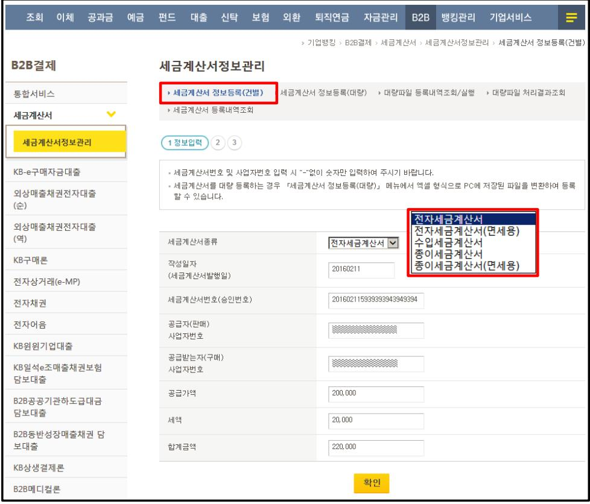

### 1. 세금계산서 정보등록(건별)

세금계산서 정보입력

조회 이체 공과금 예금 펀드 대출 신탁 보험 외환 퇴직연금 자금관리 B2B 뱅킹관리 기업서비스

> 기업병킹 > B2B결제 > 세금계산서 > 세금계산서정보관리 > 세금계산서 정보등록(건별)

B2B결제

세금계산서정보관리

통합서비스

세금계산서 정보등록(건별)

세금계산서 정보등록(대량)

▶ 대량파일 등록내역조회/실행

▶ 대량파일 처리결과조회

세금계산서

세금계산서 등록내역조회

KB-e구매자금대출

외상매출채권전자대출

(순)

외상매출채권전자대출(역)

전자세금계산서

KB구매론

세금계산서종류

전자상거래(e-MP)

작성일자

(세금계산서발행일)

20160211

전자채권

세금계산서번호(승인번호)

201602115939393943949394

전자어음

공급자(판매)

사업자번호

___

KB원기업대출

KB일석e조매출채권보험

담보대출

공급받는자(구매)

사업자번호

姓名：___  

性别：___  

年龄：___  

地址：___  

电话：___  

邮箱：___  

紧急联系人：___  

紧急联系电话：___  

医疗记录：___  

过敏史：___  

药物使用情况：___  

手术历史：___  

家族病史：___  

其他备注：___

B2B공공기관하도급대금

담보대출

공급가액

200,000

세액

20,000

B2B동반성장매출채권 담보대출

합계금액

220,000

KB상생결제론

B2B에디컬론

확인

세금계산서 정보등록은 'B2B결제' 내

「세금계산서정보관리」메뉴에서 진행이

가능합니다.

건별로 세금계산서 정보를 등록하는 경우에는 '세금계산서 정보등록(건별)'에서 세금계산서 정보를 직접 입력하실 수 있으며,

대량의 세금계산서 정보를 등록하는 경우에는 '세금계산서 정보등록(대량)'에서 엑셀파일을 업로드하여 세금계산서 정보를 일괄로 등록하실 수 있습니다.

## ※ 유의사항

ㅇ 세액이 “0원”인 경우 세금계산서 종류 선택 시「전자세금계산서(면세용)」 또는「종이세금계산서(면세용)」 선택

ㅇ 세금계산서 작성일과 발행일이 상이한 경우 “세금계산서 작성일” 입력