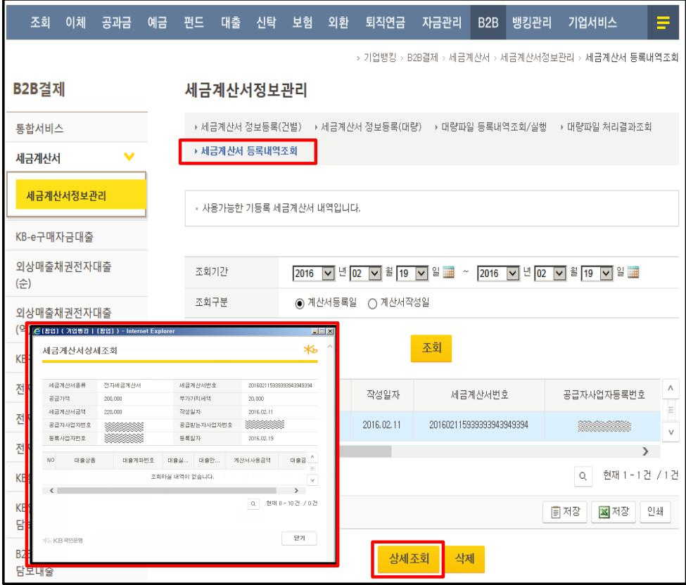

### 1. 세금계산서 정보등록(건별)

세금계산서 등록내역조회

<table border=1 style='margin: auto; width: max-content;'><tr><td style='text-align: center;'></td><td style='text-align: center;'>등록한 세금계산서 정보는 &#x27;세금계산서 등록내역조회&#x27; 메뉴에서 확인이 가능합니다. 세금계산서 관련 세부 대출실행내역을 확인하고자 하시는 경우에는 해당 세금계산서 선택 후 &#x27;상세조회&#x27; 버튼을 클릭하시면 상세내역 조회가 가능합니다. ※ 상세조회 확인가능항목 ○ 대출상품, 대출계좌번호, 세금계산서 사용금액, 대출금액 등</td></tr></table>