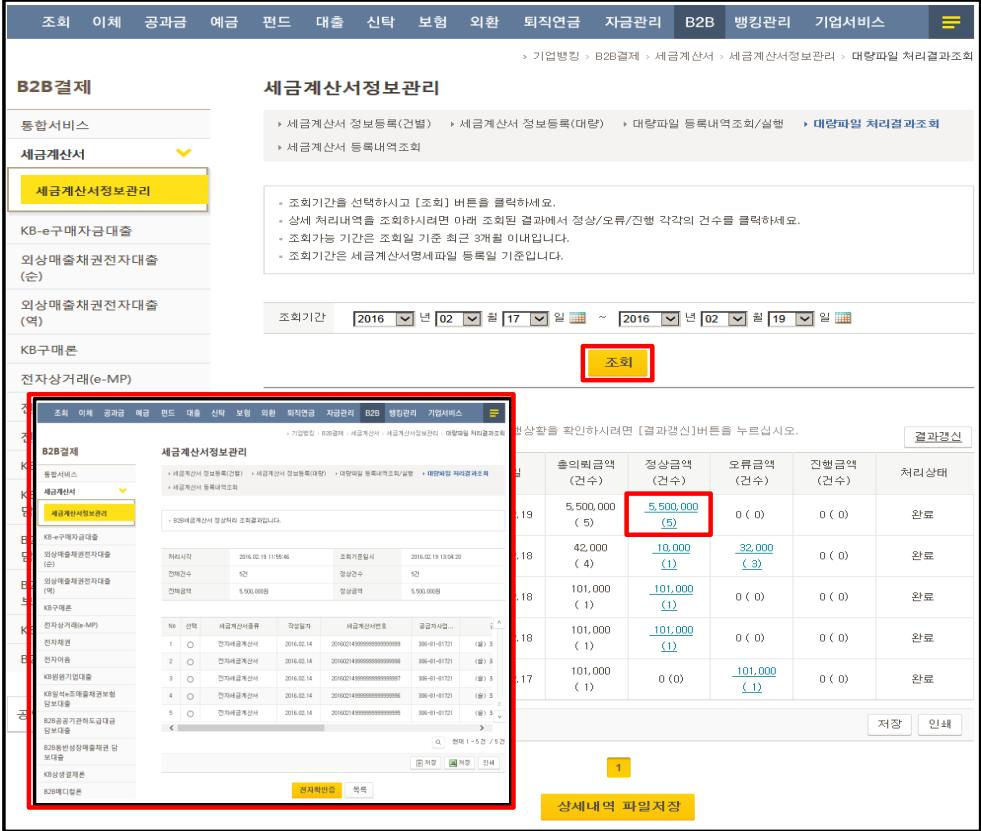

### 2. 세금계산서 정보등록(대량)

대량파일 처리결과조회

통합서비스

KB子매론

<table border=1 style='margin: auto; width: max-content;'><tr><td colspan="2">대량파일을 통한 세금계산서 정보등록 완료 후 정상 처리여부를 반드시 확인하시기 바랍니다.</td></tr><tr><td colspan="2">세금계산서 대량파일 등록일 기준으로 조회기간 설정 후 &#x27;조회&#x27; 버튼 클릭 시 처리결과 조회가 가능합니다.</td></tr><tr><td colspan="2">&#x27;정상금액(건수)&#x27; 항목에 보여지는 금액을 클릭하시면 등록한 세금계산서의 세부명세 확인이 가능하며,</td></tr><tr><td colspan="2">&#x27;오류금액(건수)&#x27; 항목에 보여지는 금액을 클릭하시면 오류명세 및 사유 등을 확인하실 수 있습니다.</td></tr></table>