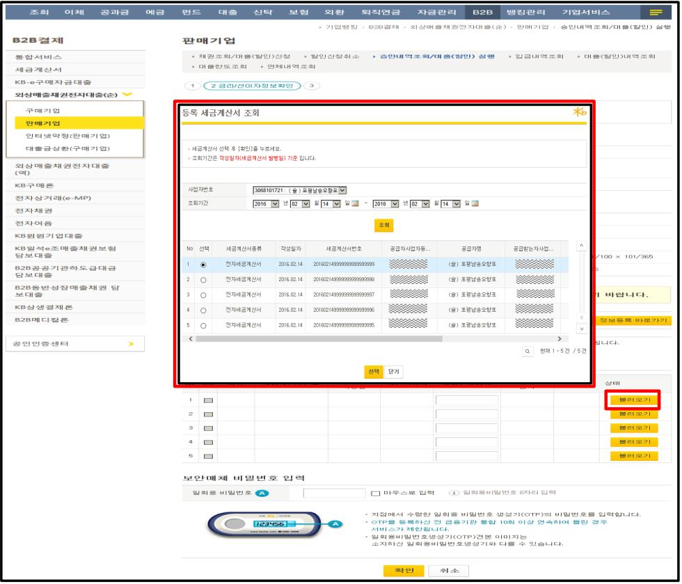

### 3. 대출실행 시 세금계산서 사전검증

세금계산서 불러오기

상품별 대출(할인)신청 단계 진행 후 세금계산서 사전검증 단계를 통해 중복 사용 및 초과사용여부를 확인 후 대출 취급이 가능합니다.

불러오기 버튼 클릭 시 사전에 등록한 세금계산서 명세내역 조회가 가능하며 사전검증을 진행할 관련 세금계산서를 선택합니다.

## ※ 참고

ㅇ 세금계산서 사전등록을 진행하지 않은 경우 '정보등록 바로가기' 버튼 클릭 시 세금계산서 정보등록 화면으로 이동하실 수 있습니다.