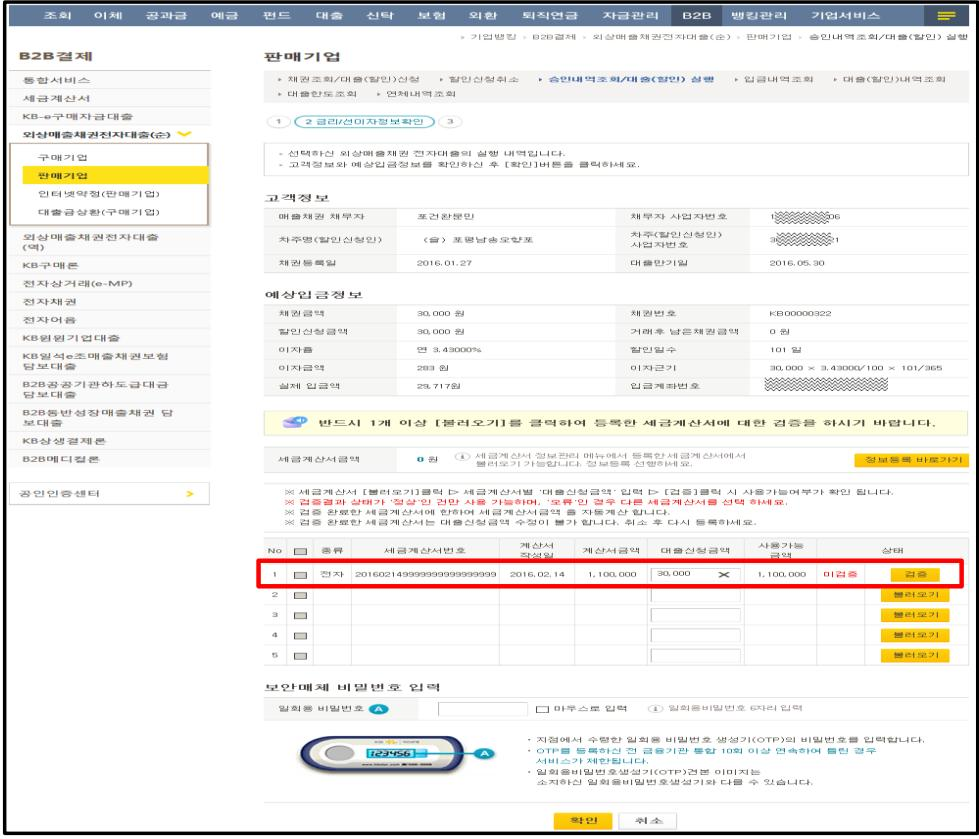

### 3. 대출실행 시 세금계산서 사전검증

세금계산서 사전검증

KB구매론

전자채권

KB상생결제론 B2B메디컬론

<table border=1 style='margin: auto; width: max-content;'><tr><td colspan="2">세금계산서 정보「불러오기」를 통해 관련 세금계산서를 선택 후, 대출신청금액 입력하고「검증」버튼을 클릭하시면 사전검증을 진행합니다.</td></tr><tr><td colspan="2">여러 건의 세금계산서 정보를 불러오기하여 합산금액 범위 내에서도 대출취급이 가능합니다.</td></tr><tr><td colspan="2">다만, 대출신청금액이 세금계산서 사용 가능금액 (세금계산서 발행금액 - 기존 대출실행금액)을 초과하는 경우에는 대출실행이 불가합니다.</td></tr></table>