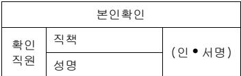

## KB 환율픽(Pick)서비스(☐신규/☐변경/☐해지) 신청서

<table border=1 style='margin: auto; width: max-content;'><tr><td style='text-align: center;'>팀원</td><td style='text-align: center;'>팀장</td><td style='text-align: center;'>부점장</td></tr><tr><td style='text-align: center;'></td><td style='text-align: center;'></td><td style='text-align: center;'></td></tr></table>

<table border=1 style='margin: auto; width: max-content;'><tr><td style='text-align: center;'>项目名称</td><td style='text-align: center;'>项目描述</td><td style='text-align: center;'>预算(万元)</td><td style='text-align: center;'>实际支出(万元)</td><td style='text-align: center;'>备注</td></tr><tr><td style='text-align: center;'>1</td><td style='text-align: center;'>项目A</td><td style='text-align: center;'>1200</td><td style='text-align: center;'>1000</td><td style='text-align: center;'>项目A实际支出1200万元，项目B实际支出1000万元</td></tr><tr><td style='text-align: center;'>2</td><td style='text-align: center;'>项目C</td><td style='text-align: center;'>800</td><td style='text-align: center;'>700</td><td style='text-align: center;'>项目C实际支出800万元，项目D实际支出700万元</td></tr><tr><td style='text-align: center;'>3</td><td style='text-align: center;'>项目E</td><td style='text-align: center;'>500</td><td style='text-align: center;'>400</td><td style='text-align: center;'>项目E实际支出500万元，项目F实际支出400万元</td></tr><tr><td style='text-align: center;'>4</td><td style='text-align: center;'>项目G</td><td style='text-align: center;'>300</td><td style='text-align: center;'>200</td><td style='text-align: center;'>项目G实际支出300万元，项目H实际支出200万元</td></tr><tr><td style='text-align: center;'>5</td><td style='text-align: center;'>项目I</td><td style='text-align: center;'>200</td><td style='text-align: center;'>100</td><td style='text-align: center;'>项目I实际支出200万元，项目J实际支出100万元</td></tr><tr><td style='text-align: center;'>6</td><td style='text-align: center;'>项目K</td><td style='text-align: center;'>100</td><td style='text-align: center;'>80</td><td style='text-align: center;'>项目K实际支出100万元，项目L实际支出80万元</td></tr><tr><td style='text-align: center;'>7</td><td style='text-align: center;'>项目M</td><td style='text-align: center;'>50</td><td style='text-align: center;'>40</td><td style='text-align: center;'>项目M实际支出50万元，项目N实际支出30万元</td></tr><tr><td style='text-align: center;'>8</td><td style='text-align: center;'>项目O</td><td style='text-align: center;'>30</td><td style='text-align: center;'>20</td><td style='text-align: center;'>项目O实际支出30万元，项目P实际支出20万元</td></tr><tr><td style='text-align: center;'>9</td><td style='text-align: center;'>项目Q</td><td style='text-align: center;'>20</td><td style='text-align: center;'>10</td><td style='text-align: center;'>项目Q实际支出20万元，项目R实际支出10万元</td></tr><tr><td style='text-align: center;'>10</td><td style='text-align: center;'>项目S</td><td style='text-align: center;'>10</td><td style='text-align: center;'>8</td><td style='text-align: center;'>项目S实际支出10万元，项目T实际支出8万元</td></tr><tr><td style='text-align: center;'>11</td><td style='text-align: center;'>项目T</td><td style='text-align: center;'>5</td><td style='text-align: center;'>4</td><td style='text-align: center;'>项目T实际支出5万元，项目U实际支出3万元</td></tr><tr><td style='text-align: center;'>12</td><td style='text-align: center;'>项目U</td><td style='text-align: center;'>3</td><td style='text-align: center;'>2</td><td style='text-align: center;'>项目U实际支出3万元，项目V实际支出2万元</td></tr><tr><td style='text-align: center;'>13</td><td style='text-align: center;'>项目V</td><td style='text-align: center;'>2</td><td style='text-align: center;'>1</td><td style='text-align: center;'>项目V实际支出2万元，项目W实际支出1万元</td></tr><tr><td style='text-align: center;'>14</td><td style='text-align: center;'>项目W</td><td style='text-align: center;'>1</td><td style='text-align: center;'>0</td><td style='text-align: center;'>项目W实际支出1万元，项目X实际支出0万元</td></tr><tr><td style='text-align: center;'>15</td><td style='text-align: center;'>项目X</td><td style='text-align: center;'>0</td><td style='text-align: center;'>0</td><td style='text-align: center;'>项目X实际支出0万元，项目Y实际支出1万元</td></tr><tr><td style='text-align: center;'>16</td><td style='text-align: center;'>项目Y</td><td style='text-align: center;'>0</td><td style='text-align: center;'>0</td><td style='text-align: center;'>项目Y实际支出0万元，项目Z实际支出1万元</td></tr><tr><td style='text-align: center;'>17</td><td style='text-align: center;'>项目Z</td><td style='text-align: center;'>0</td><td style='text-align: center;'>0</td><td style='text-align: center;'>项目Z实际支出0万元，项目A实际支出1万元</td></tr><tr><td style='text-align: center;'>18</td><td style='text-align: center;'>项目A</td><td style='text-align: center;'>0</td><td style='text-align: center;'>0</td><td style='text-align: center;'>项目A实际支出0万元，项目B实际支出1万元</td></tr><tr><td style='text-align: center;'>19</td><td style='text-align: center;'>项目B</td><td style='text-align: center;'>0</td><td style='text-align: center;'>0</td><td style='text-align: center;'>项目B实际支出0万元，项目C实际支出1万元</td></tr><tr><td style='text-align: center;'>20</td><td style='text-align: center;'>项目C</td><td style='text-align: center;'>0</td><td style='text-align: center;'>0</td><td style='text-align: center;'>项目C实际支出0万元，项目D实际支出1万元</td></tr><tr><td style='text-align: center;'>21</td><td style='text-align: center;'>项目D</td><td style='text-align: center;'>0</td><td style='text-align: center;'>0</td><td style='text-align: center;'>项目D实际支出0万元，项目E实际支出1万元</td></tr><tr><td style='text-align: center;'>22</td><td style='text-align: center;'>项目E</td><td style='text-align: center;'>0</td><td style='text-align: center;'>0</td><td style='text-align: center;'>项目E实际支出0万元，项目F实际支出1万元</td></tr><tr><td style='text-align: center;'>23</td><td style='text-align: center;'>项目F</td><td style='text-align: center;'>0</td><td style='text-align: center;'>0</td><td style='text-align: center;'>项目F实际支出0万元，项目G实际支出1万元</td></tr><tr><td style='text-align: center;'>24</td><td style='text-align: center;'>项目G</td><td style='text-align: center;'>0</td><td style='text-align: center;'>0</td><td style='text-align: center;'>项目G实际支出0万元，项目H实际支出1万元</td></tr><tr><td style='text-align: center;'>25</td><td style='text-align: center;'>项目H</td><td style='text-align: center;'>0</td><td style='text-align: center;'>0</td><td style='text-align: center;'>项目H实际支出0万元，项目I实际支出1万元</td></tr><tr><td style='text-align: center;'>26</td><td style='text-align: center;'>项目I</td><td style='text-align: center;'>0</td><td style='text-align: center;'>0</td><td style='text-align: center;'>项目I实际支出0万元，项目J实际支出1万元</td></tr><tr><td style='text-align: center;'>27</td><td style='text-align: center;'>项目J</td><td style='text-align: center;'>0</td><td style='text-align: center;'>0</td><td style='text-align: center;'>项目J实际支出0万元，项目K实际支出1万元</td></tr><tr><td style='text-align: center;'>28</td><td style='text-align: center;'>项目K</td><td style='text-align: center;'>0</td><td style='text-align: center;'>0</td><td style='text-align: center;'>项目K实际支出0万元，项目L实际支出1万元</td></tr><tr><td style='text-align: center;'>29</td><td style='text-align: center;'>项目L</td><td style='text-align: center;'>0</td><td style='text-align: center;'>0</td><td style='text-align: center;'>项目L实际支出0万元，项目M实际支出1万元</td></tr><tr><td style='text-align: center;'>30</td><td style='text-align: center;'>项目M</td><td style='text-align: center;'>0</td><td style='text-align: center;'>0</td><td style='text-align: center;'>项目M实际支出0万元，项目N实际支出1万元</td></tr><tr><td style='text-align: center;'>31</td><td style='text-align: center;'>项目N</td><td style='text-align: center;'>0</td><td style='text-align: center;'>0</td><td style='text-align: center;'>项目N实际支出0万元，项目O实际支出1万元</td></tr><tr><td style='text-align: center;'>32</td><td style='text-align: center;'>项目O</td><td style='text-align: center;'>0</td><td style='text-align: center;'>0</td><td style='text-align: center;'>项目O实际支出0万元，项目P实际支出1万元</td></tr><tr><td style='text-align: center;'>33</td><td style='text-align: center;'>项目P</td><td style='text-align: center;'>0</td><td style='text-align: center;'>0</td><td style='text-align: center;'>项目P实际支出0万元，项目Q实际支出1万元</td></tr><tr><td style='text-align: center;'>34</td><td style='text-align: center;'>项目Q</td><td style='text-align: center;'>0</td><td style='text-align: center;'>0</td><td style='text-align: center;'>项目Q实际支出0万元，项目R实际支出1万元</td></tr><tr><td style='text-align: center;'>35</td><td style='text-align: center;'>项目R</td><td style='text-align: center;'>0</td><td style='text-align: center;'>0</td><td style='text-align: center;'>项目R实际支出0万元，项目S实际支出1万元</td></tr><tr><td style='text-align: center;'>36</td><td style='text-align: center;'>项目S</td><td style='text-align: center;'>0</td><td style='text-align: center;'>0</td><td style='text-align: center;'>项目S实际支出0万元，项目T实际支出1万元</td></tr><tr><td style='text-align: center;'>37</td><td style='text-align: center;'>项目T</td><td style='text-align: center;'>0</td><td style='text-align: center;'>0</td><td style='text-align: center;'>项目T实际支出0万元，项目U实际支出1万元</td></tr><tr><td style='text-align: center;'>38</td><td style='text-align: center;'>项目U</td><td style='text-align: center;'>0</td><td style='text-align: center;'>0</td><td style='text-align: center;'>项目U实际支出0万元，项目V实际支出1万元</td></tr><tr><td style='text-align: center;'>39</td><td style='text-align: center;'>项目V</td><td style='text-align: center;'>0</td><td style='text-align: center;'>0</td><td style='text-align: center;'>项目V实际支出0万元，项目W实际支出1万元</td></tr><tr><td style='text-align: center;'>40</td><td style='text-align: center;'>项目W</td><td style='text-align: center;'>0</td><td style='text-align: center;'>0</td><td style='text-align: center;'>项目W实际支出0万元，项目X实际支出1万元</td></tr><tr><td style='text-align: center;'>41</td><td style='text-align: center;'>项目X</td><td style='text-align: center;'>0</td><td style='text-align: center;'>0</td><td style='text-align: center;'>项目X实际支出0万元，项目Y实际支出1万元</td></tr><tr><td style='text-align: center;'>42</td><td style='text-align: center;'>项目Y</td><td style='text-align: center;'>0</td><td style='text-align: center;'>0</td><td style='text-align: center;'>项目Y实际支出0万元，项目Z实际支出1万元</td></tr><tr><td style='text-align: center;'>43</td><td style='text-align: center;'>项目Z</td><td style='text-align: center;'>0</td><td style='text-align: center;'>0</td><td style='text-align: center;'>项目Z实际支出0万元，项目A实际支出1万元</td></tr><tr><td style='text-align: center;'>44</td><td style='text-align: center;'>项目A</td><td style='text-align: center;'>0</td><td style='text-align: center;'>0</td><td style='text-align: center;'>项目A实际支出0万元，项目B实际支出1万元</td></tr><tr><td style='text-align: center;'>45</td><td style='text-align: center;'>项目B</td><td style='text-align: center;'>0</td><td style='text-align: center;'>0</td><td style='text-align: center;'>项目B实际支出0万元，项目C实际支出1万元</td></tr><tr><td style='text-align: center;'>46</td><td style='text-align: center;'>项目C</td><td style='text-align: center;'>0</td><td style='text-align: center;'>0</td><td style='text-align: center;'>项目C实际支出0万元，项目D实际支出1万元</td></tr><tr><td style='text-align: center;'>47</td><td style='text-align: center;'>项目D</td><td style='text-align: center;'>0</td><td style='text-align: center;'>0</td><td style='text-align: center;'>项目D实际支出0万元，项目E实际支出1万元</td></tr><tr><td style='text-align: center;'>48</td><td style='text-align: center;'>项目E</td><td style='text-align: center;'>0</td><td style='text-align: center;'>0</td><td style='text-align: center;'>项目E实际支出0万元，项目F实际支出1万元</td></tr><tr><td style='text-align: center;'>49</td><td style='text-align: center;'>项目F</td><td style='text-align: center;'>0</td><td style='text-align: center;'>0</td><td style='text-align: center;'>项目F实际支出0万元，项目G实际支出1万元</td></tr><tr><td style='text-align: center;'>50</td><td style='text-align: center;'>项目G</td><td style='text-align: center;'>0</td><td style='text-align: center;'>0</td><td style='text-align: center;'>项目G实际支出0万元，项目H实际支出1万元</td></tr><tr><td style='text-align: center;'>51</td><td style='text-align: center;'>项目H</td><td style='text-align: center;'>0</td><td style='text-align: center;'>0</td><td style='text-align: center;'>项目H实际支出0万元，项目I实际支出1万元</td></tr><tr><td style='text-align: center;'>52</td><td style='text-align: center;'>项目I</td><td style='text-align: center;'>0</td><td style='text-align: center;'>0</td><td style='text-align: center;'>项目I实际支出0万元，项目J实际支出1万元</td></tr><tr><td style='text-align: center;'>53</td><td style='text-align: center;'>项目J</td><td style='text-align: center;'>0</td><td style='text-align: center;'>0</td><td style='text-align: center;'>项目J实际支出0万元，项目K实际支出1万元</td></tr><tr><td style='text-align: center;'>54</td><td style='text-align: center;'>项目K</td><td style='text-align: center;'>0</td><td style='text-align: center;'>0</td><td style='text-align: center;'>项目K实际支出0万元，项目L实际支出1万元</td></tr><tr><td style='text-align: center;'>55</td><td style='text-align: center;'>项目L</td><td style='text-align: center;'>0</td><td style='text-align: center;'>0</td><td style='text-align: center;'>项目L实际支出0万元，项目M实际支出1万元</td></tr><tr><td style='text-align: center;'>56</td><td style='text-align: center;'>项目M</td><td style='text-align: center;'>0</td><td style='text-align: center;'>0</td><td style='text-align: center;'>项目M实际支出0万元，项目N实际支出1万元</td></tr><tr><td style='text-align: center;'>57</td><td style='text-align: center;'>项目N</td><td style='text-align: center;'>0</td><td style='text-align: center;'>0</td><td style='text-align: center;'>项目N实际支出0万元，项目O实际支出1万元</td></tr><tr><td style='text-align: center;'>58</td><td style='text-align: center;'>项目O</td><td style='text-align: center;'>0</td><td style='text-align: center;'>0</td><td style='text-align: center;'>项目O实际支出0万元，项目P实际支出1万元</td></tr><tr><td style='text-align: center;'>59</td><td style='text-align: center;'>项目P</td><td style='text-align: center;'>0</td><td style='text-align: center;'>0</td><td style='text-align: center;'>项目P实际支出0万元，项目Q实际支出1万元</td></tr><tr><td style='text-align: center;'>60</td><td style='text-align: center;'>项目Q</td><td style='text-align: center;'>0</td><td style='text-align: center;'>0</td><td style='text-align: center;'>项目Q实际支出0万元，项目R实际支出1万元</td></tr><tr><td style='text-align: center;'>61</td><td style='text-align: center;'>项目R</td><td style='text-align: center;'>0</td><td style='text-align: center;'>0</td><td style='text-align: center;'>项目R实际支出0万元，项目S实际支出1万元</td></tr><tr><td style='text-align: center;'>62</td><td style='text-align: center;'>项目S</td><td style='text-align: center;'>0</td><td style='text-align: center;'>0</td><td style='text-align: center;'>项目S实际支出0万元，项目T实际支出1万元</td></tr><tr><td style='text-align: center;'>63</td><td style='text-align: center;'>项目T</td><td style='text-align: center;'>0</td><td style='text-align: center;'>0</td><td style='text-align: center;'>项目T实际支出0万元，项目U实际支出1万元</td></tr><tr><td style='text-align: center;'>64</td><td style='text-align: center;'>项目U</td><td style='text-align: center;'>0</td><td style='text-align: center;'>0</td><td style='text-align: center;'>项目U实际支出0万元，项目V实际支出1万元</td></tr><tr><td style='text-align: center;'>65</td><td style='text-align: center;'>项目V</td><td style='text-align: center;'>0</td><td style='text-align: center;'>0</td><td style='text-align: center;'>项目V实际支出0万元，项目W实际支出1万元</td></tr><tr><td style='text-align: center;'>66</td><td style='text-align: center;'>项目W</td><td style='text-align: center;'>0</td><td style='text-align: center;'>0</td><td style='text-align: center;'>项目W实际支出0万元，项目X实际支出1万元</td></tr><tr><td style='text-align: center;'>67</td><td style='text-align: center;'>项目X</td><td style='text-align: center;'>0</td><td style='text-align: center;'>0</td><td style='text-align: center;'>项目X实际支出0万元，项目Y实际支出1万元</td></tr><tr><td style='text-align: center;'>68</td><td style='text-align: center;'>项目Y</td><td style='text-align: center;'>0</td><td style='text-align: center;'>0</td><td style='text-align: center;'>项目Y实际支出0万元，项目Z实际支出1万元</td></tr><tr><td style='text-align: center;'>69</td><td style='text-align: center;'>项目Z</td><td style='text-align: center;'>0</td><td style='text-align: center;'>0</td><td style='text-align: center;'>项目Z实际支出0万元，项目A实际支出1万元</td></tr><tr><td style='text-align: center;'>70</td><td style='text-align: center;'>项目A</td><td style='text-align: center;'>0</td><td style='text-align: center;'>0</td><td style='text-align: center;'>项目A实际支出0万元，项目B实际支出1万元</td></tr><tr><td style='text-align: center;'>71</td><td style='text-align: center;'>项目B</td><td style='text-align: center;'>0</td><td style='text-align: center;'>0</td><td style='text-align: center;'>项目B实际支出0万元，项目C实际支出1万元</td></tr><tr><td style='text-align: center;'>72</td><td style='text-align: center;'>项目C</td><td style='text-align: center;'>0</td><td style='text-align: center;'>0</td><td style='text-align: center;'>项目C实际支出0万元，项目D实际支出1万元</td></tr><tr><td style='text-align: center;'>73</td><td style='text-align: center;'>项目D</td><td style='text-align: center;'>0</td><td style='text-align: center;'>0</td><td style='text-align: center;'>项目D实际支出0万元，项目E实际支出1万元</td></tr><tr><td style='text-align: center;'>74</td><td style='text-align: center;'>项目E</td><td style='text-align: center;'>0</td><td style='text-align: center;'>0</td><td style='text-align: center;'>项目E实际支出0万元，项目F实际支出1万元</td></tr><tr><td style='text-align: center;'>75</td><td style='text-align: center;'>项目F</td><td style='text-align: center;'>0</td><td style='text-align: center;'>0</td><td style='text-align: center;'>项目F实际支出0万元，项目G实际支出1万元</td></tr><tr><td style='text-align: center;'>76</td><td style='text-align: center;'>项目G</td><td style='text-align: center;'>0</td><td style='text-align: center;'>0</td><td style='text-align: center;'>项目G实际支出0万元，项目H实际支出1万元</td></tr><tr><td style='text-align: center;'>77</td><td style='text-align: center;'>项目H</td><td style='text-align: center;'>0</td><td style='text-align: center;'>0</td><td style='text-align: center;'>项目H实际支出0万元，项目I实际支出1万元</td></tr><tr><td style='text-align: center;'>78</td><td style='text-align: center;'>项目I</td><td style='text-align: center;'>0</td><td style='text-align: center;'>0</td><td style='text-align: center;'>项目I实际支出0万元，项目J实际支出1万元</td></tr><tr><td style='text-align: center;'>79</td><td style='text-align: center;'>项目J</td><td style='text-align: center;'>0</td><td style='text-align: center;'>0</td><td style='text-align: center;'>项目J实际支出0万元，项目K实际支出1万元</td></tr><tr><td style='text-align: center;'>80</td><td style='text-align: center;'>项目K</td><td style='text-align: center;'>0</td><td style='text-align: center;'>0</td><td style='text-align: center;'>项目K实际支出0万元，项目L实际支出1万元</td></tr><tr><td style='text-align: center;'>81</td><td style='text-align: center;'>项目L</td><td style='text-align: center;'>0</td><td style='text-align: center;'>0</td><td style='text-align: center;'>项目L实际支出0万元，项目M实际支出1万元</td></tr><tr><td style='text-align: center;'>82</td><td style='text-align: center;'>项目M</td><td style='text-align: center;'>0</td><td style='text-align: center;'>0</td><td style='text-align: center;'>项目M实际支出0万元，项目N实际支出1万元</td></tr><tr><td style='text-align: center;'>83</td><td style='text-align: center;'>项目N</td><td style='text-align: center;'>0</td><td style='text-align: center;'>0</td><td style='text-align: center;'>项目N实际支出0万元，项目O实际支出1万元</td></tr><tr><td style='text-align: center;'>84</td><td style='text-align: center;'>项目O</td><td style='text-align: center;'>0</td><td style='text-align: center;'>0</td><td style='text-align: center;'>项目O实际支出0万元，项目P实际支出1万元</td></tr><tr><td style='text-align: center;'>85</td><td style='text-align: center;'>项目P</td><td style='text-align: center;'>0</td><td style='text-align: center;'>0</td><td style='text-align: center;'>项目P实际支出0万元，项目Q实际支出1万元</td></tr><tr><td style='text-align: center;'>86</td><td style='text-align: center;'>项目Q</td><td style='text-align: center;'>0</td><td style='text-align: center;'>0</td><td style='text-align: center;'>项目Q实际支出0万元，项目R实际支出1万元</td></tr><tr><td style='text-align: center;'>87</td><td style='text-align: center;'>项目R</td><td style='text-align: center;'>0</td><td style='text-align: center;'>0</td><td style='text-align: center;'>项目R实际支出0万元，项目S实际支出1万元</td></tr><tr><td style='text-align: center;'>88</td><td style='text-align: center;'>项目S</td><td style='text-align: center;'>0</td><td style='text-align: center;'>0</td><td style='text-align: center;'>项目S实际支出0万元，项目T实际支出1万元</td></tr><tr><td style='text-align: center;'>89</td><td style='text-align: center;'>项目T</td><td style='text-align: center;'>0</td><td style='text-align: center;'>0</td><td style='text-align: center;'>项目T实际支出0万元，项目U实际支出1万元</td></tr><tr><td style='text-align: center;'>90</td><td style='text-align: center;'>项目U</td><td style='text-align: center;'>0</td><td style='text-align: center;'>0</td><td style='text-align: center;'>项目U实际支出0万元，项目V实际支出1万元</td></tr><tr><td style='text-align: center;'>91</td><td style='text-align: center;'>项目V</td><td style='text-align: center;'>0</td><td style='text-align: center;'>0</td><td style='text-align: center;'>项目V实际支出0万元，项目W实际支出1万元</td></tr><tr><td style='text-align: center;'>92</td><td style='text-align: center;'>项目W</td><td style='text-align: center;'>0</td><td style='text-align: center;'>0</td><td style='text-align: center;'>项目W实际支出0万元，项目X实际支出1万元</td></tr><tr><td style='text-align: center;'>93</td><td style='text-align: center;'>项目X</td><td style='text-align: center;'>0</td><td style='text-align: center;'>0</td><td style='text-align: center;'>项目X实际支出0万元，项目Y实际支出1万元</td></tr><tr><td style='text-align: center;'>94</td><td style='text-align: center;'>项目Y</td><td style='text-align: center;'>0</td><td style='text-align: center;'>0</td><td style='text-align: center;'>项目Y实际支出0万元，项目Z实际支出1万元</td></tr><tr><td style='text-align: center;'>95</td><td style='text-align: center;'>项目Z</td><td style='text-align: center;'>0</td><td style='text-align: center;'>0</td><td style='text-align: center;'>项目Z实际支出0万元，项目A实际支出1万元</td></tr><tr><td style='text-align: center;'>96</td><td style='text-align: center;'>项目A</td><td style='text-align: center;'>0</td><td style='text-align: center;'>0</td><td style='text-align: center;'>项目A实际支出0万元，项目B实际支出1万元</td></tr><tr><td style='text-align: center;'>97</td><td style='text-align: center;'>项目B</td><td style='text-align: center;'>0</td><td style='text-align: center;'>0</td><td style='text-align: center;'>项目B实际支出0万元，项目C实际支出1万元</td></tr><tr><td style='text-align: center;'>98</td><td style='text-align: center;'>项目C</td><td style='text-align: center;'>0</td><td style='text-align: center;'>0</td><td style='text-align: center;'>项目C实际支出0万元，项目D实际支出1万元</td></tr><tr><td style='text-align: center;'>99</td><td style='text-align: center;'>项目D</td><td style='text-align: center;'>0</td><td style='text-align: center;'>0</td><td style='text-align: center;'>项目D实际支出0万元，项目E实际支出1万元</td></tr><tr><td style='text-align: center;'>100</td><td style='text-align: center;'>项目E</td><td style='text-align: center;'>0</td><td style='text-align: center;'>0</td><td style='text-align: center;'>项目E实际支出0万元，项目F实际支出1万元</td></tr><tr><td style='text-align: center;'>101</td><td style='text-align: center;'>项目F</td><td style='text-align: center;'>0</td><td style='text-align: center;'>0</td><td style='text-align: center;'>项目F实际支出0万元，项目G实际支出1万元</td></tr><tr><td style='text-align: center;'>102</td><td style='text-align: center;'>项目G</td><td style='text-align: center;'>0</td><td style='text-align: center;'>0</td><td style='text-align: center;'>项目G实际支出0万元，项目H实际支出1万元</td></tr><tr><td style='text-align: center;'>103</td><td style='text-align: center;'>项目H</td><td style='text-align: center;'>0</td><td style='text-align: center;'>0</td><td style='text-align: center;'>项目H实际支出0万元，项目I实际支出1万元</td></tr><tr><td style='text-align: center;'>104</td><td style='text-align: center;'>项目I</td><td style='text-align: center;'>0</td><td style='text-align: center;'>0</td><td style='text-align: center;'>项目I实际支出0万元，项目J实际支出1万元</td></tr><tr><td style='text-align: center;'>105</td><td style='text-align: center;'>项目J</td><td style='text-align: center;'>0</td><td style='text-align: center;'>0</td><td style='text-align: center;'>项目J实际支出0万元，项目K实际支出1万元</td></tr><tr><td style='text-align: center;'>106</td><td style='text-align: center;'>项目K</td><td style='text-align: center;'>0</td><td style='text-align: center;'>0</td><td style='text-align: center;'>项目K实际支出0万元，项目L实际支出1万元</td></tr><tr><td style='text-align: center;'>107</td><td style='text-align: center;'>项目L</td><td style='text-align: center;'>0</td><td style='text-align: center;'>0</td><td style='text-align: center;'>项目L实际支出0万元，项目M实际支出1万元</td></tr><tr><td style='text-align: center;'>108</td><td style='text-align: center;'>项目M</td><td style='text-align: center;'>0</td><td style='text-align: center;'>0</td><td style='text-align: center;'>项目M实际支出0万元，项目N实际支出1万元</td></tr><tr><td style='text-align: center;'>109</td><td style='text-align: center;'>项目N</td><td style='text-align: center;'>0</td><td style='text-align: center;'>0</td><td style='text-align: center;'>项目N实际支出0万元，项目O实际支出1万元</td></tr><tr><td style='text-align: center;'>110</td><td style='text-align: center;'>项目O</td><td style='text-align: center;'>0</td><td style='text-align: center;'>0</td><td style='text-align: center;'>项目O实际支出0万元，项目P实际支出1万元</td></tr><tr><td style='text-align: center;'>111</td><td style='text-align: center;'>项目P</td><td style='text-align: center;'>0</td><td style='text-align: center;'>0</td><td style='text-align: center;'>项目P实际支出0万元，项目Q实际支出1万元</td></tr><tr><td style='text-align: center;'>112</td><td style='text-align: center;'>项目Q</td><td style='text-align: center;'>0</td><td style='text-align: center;'>0</td><td style='text-align: center;'>项目Q实际支出0万元，项目R实际支出1万元</td></tr><tr><td style='text-align: center;'>113</td><td style='text-align: center;'>项目R</td><td style='text-align: center;'>0</td><td style='text-align: center;'>0</td><td style='text-align: center;'>项目R实际支出0万元，项目S实际支出1万元</td></tr><tr><td style='text-align: center;'>114</td><td style='text-align: center;'>项目S</td><td style='text-align: center;'>0</td><td style='text-align: center;'>0</td><td style='text-align: center;'>项目S实际支出0万元，项目T实际支出1万元</td></tr><tr><td style='text-align: center;'>115</td><td style='text-align: center;'>项目T</td><td style='text-align: center;'>0</td><td style='text-align: center;'>0</td><td style='text-align: center;'>项目T实际支出0万元，项目U实际支出1万元</td></tr><tr><td style='text-align: center;'>116</td><td style='text-align: center;'>项目U</td><td style='text-align: center;'>0</td><td style='text-align: center;'>0</td><td style='text-align: center;'>项目U实际支出0万元，项目V实际支出1万元</td></tr><tr><td style='text-align: center;'>117</td><td style='text-align: center;'>项目V</td><td style='text-align: center;'>0</td><td style='text-align: center;'>0</td><td style='text-align: center;'>项目V实际支出0万元，项目W实际支出1万元</td></tr><tr><td style='text-align: center;'>118</td><td style='text-align: center;'>项目W</td><td style='text-align: center;'>0</td><td style='text-align: center;'>0</td><td style='text-align: center;'>项目W实际支出0万元，项目X实际支出1万元</td></tr><tr><td style='text-align: center;'>119</td><td style='text-align: center;'>项目X</td><td style='text-align: center;'>0</td><td style='text-align: center;'>0</td><td style='text-align: center;'>项目X实际支出0万元，项目Y实际支出1万元</td></tr><tr><td style='text-align: center;'>120</td><td style='text-align: center;'>项目Y</td><td style='text-align: center;'>0</td><td style='text-align: center;'>0</td><td style='text-align: center;'>项目Y实际支出0万元，项目Z实际支出1万元</td></tr><tr><td style='text-align: center;'>121</td><td style='text-align: center;'>项目Z</td><td style='text-align: center;'>0</td><td style='text-align: center;'>0</td><td style='text-align: center;'>项目Z实际支出0万元，项目A实际支出1万元</td></tr><tr><td style='text-align: center;'>122</td><td style='text-align: center;'>项目A</td><td style='text-align: center;'>0</td><td style='text-align: center;'>0</td><td style='text-align: center;'>项目A实际支出0万元，项目B实际支出1万元</td></tr><tr><td style='text-align: center;'>123</td><td style='text-align: center;'>项目B</td><td style='text-align: center;'>0</td><td style='text-align: center;'>0</td><td style='text-align: center;'>项目B实际支出0万元，项目C实际支出1万元</td></tr><tr><td style='text-align: center;'>124</td><td style='text-align: center;'>项目C</td><td style='text-align: center;'>0</td><td style='text-align: center;'>0</td><td style='text-align: center;'>项目C实际支出0万元，项目D实际支出1万元</td></tr><tr><td style='text-align: center;'>125</td><td style='text-align: center;'>项目D</td><td style='text-align: center;'>0</td><td style='text-align: center;'>0</td><td style='text-align: center;'>项目D实际支出0万元，项目E实际支出1万元</td></tr><tr><td style='text-align: center;'>126</td><td style='text-align: center;'>项目E</td><td style='text-align: center;'>0</td><td style='text-align: center;'>0</td><td style='text-align: center;'>项目E实际支出0万元，项目F实际支出1万元</td></tr><tr><td style='text-align: center;'>127</td><td style='text-align: center;'>项目F</td><td style='text-align: center;'>0</td><td style='text-align: center;'>0</td><td style='text-align: center;'>项目F实际支出0万元，项目G实际支出1万元</td></tr><tr><td style='text-align: center;'>128</td><td style='text-align: center;'>项目G</td><td style='text-align: center;'>0</td><td style='text-align: center;'>0</td><td style='text-align: center;'>项目G实际支出0万元，项目H实际支出1万元</td></tr><tr><td style='text-align: center;'>129</td><td style='text-align: center;'>项目H</td><td style='text-align: center;'>0</td><td style='text-align: center;'>0</td><td style='text-align: center;'>项目H实际支出0万元，项目I实际支出1万元</td></tr><tr><td style='text-align: center;'>130</td><td style='text-align: center;'>项目I</td><td style='text-align: center;'>0</td><td style='text-align: center;'>0</td><td style='text-align: center;'>项目I实际支出0万元，项目J实际支出1万元</td></tr><tr><td style='text-align: center;'>131</td><td style='text-align: center;'>项目J</td><td style='text-align: center;'>0</td><td style='text-align: center;'>0</td><td style='text-align: center;'>项目J实际支出0万元，项目K实际支出1万元</td></tr><tr><td style='text-align: center;'>132</td><td style='text-align: center;'>项目K</td><td style='text-align: center;'>0</td><td style='text-align: center;'>0</td><td style='text-align: center;'>项目K实际支出0万元，项目L实际支出1万元</td></tr><tr><td style='text-align: center;'>133</td><td style='text-align: center;'>项目L</td><td style='text-align: center;'>0</td><td style='text-align: center;'>0</td><td style='text-align: center;'>项目L实际支出0万元，项目M实际支出1万元</td></tr><tr><td style='text-align: center;'>134</td><td style='text-align: center;'>项目M</td><td style='text-align: center;'>0</td><td style='text-align: center;'>0</td><td style='text-align: center;'>项目M实际支出0万元，项目N实际支出1万元</td></tr><tr><td style='text-align: center;'>135</td><td style='text-align: center;'>项目N</td><td style='text-align: center;'>0</td><td style='text-align: center;'>0</td><td style='text-align: center;'>项目N实际支出0万元，项目O实际支出1万元</td></tr><tr><td style='text-align: center;'>136</td><td style='text-align: center;'>项目O</td><td style='text-align: center;'>0</td><td style='text-align: center;'>0</td><td style='text-align: center;'>项目O实际支出0万元，项目P实际支出1万元</td></tr><tr><td style='text-align: center;'>137</td><td style='text-align: center;'>项目P</td><td style='text-align: center;'>0</td><td style='text-align: center;'>0</td><td style='text-align: center;'>项目P实际支出0万元，项目Q实际支出1万元</td></tr><tr><td style='text-align: center;'>138</td><td style='text-align: center;'>项目Q</td><td style='text-align: center;'>0</td><td style='text-align: center;'>0</td><td style='text-align: center;'>项目Q实际支出0万元，项目R实际支出1万元</td></tr><tr><td style='text-align: center;'>139</td><td style='text-align: center;'>项目R</td><td style='text-align: center;'>0</td><td style='text-align: center;'>0</td><td style='text-align: center;'>项目R实际支出0万元，项目S实际支出1万元</td></tr><tr><td style='text-align: center;'>140</td><td style='text-align: center;'>项目S</td><td style='text-align: center;'>0</td><td style='text-align: center;'>0</td><td style='text-align: center;'>项目S实际支出0万元，项目T实际支出1万元</td></tr><tr><td style='text-align: center;'>141</td><td style='text-align: center;'>项目T</td><td style='text-align: center;'>0</td><td style='text-align: center;'>0</td><td style='text-align: center;'>项目T实际支出0万元，项目U实际支出1万元</td></tr><tr><td style='text-align: center;'>142</td><td style='text-align: center;'>项目U</td><td style='text-align: center;'>0</td><td style='text-align: center;'>0</td><td style='text-align: center;'>项目U实际支出0万元，项目V实际支出1万元</td></tr><tr><td style='text-align: center;'>143</td><td style='text-align: center;'>项目V</td><td style='text-align: center;'>0</td><td style='text-align: center;'>0</td><td style='text-align: center;'>项目V实际支出0万元，项目W实际支出1万元</td></tr><tr><td style='text-align: center;'>144</td><td style='text-align: center;'>项目W</td><td style='text-align: center;'>0</td><td style='text-align: center;'>0</td><td style='text-align: center;'>项目W实际支出0万元，项目X实际支出1万元</td></tr><tr><td style='text-align: center;'>145</td><td style='text-align: center;'>项目X</td><td style='text-align: center;'>0</td><td style='text-align: center;'>0</td><td style='text-align: center;'>项目X实际支出0万元，项目Y实际支出1万元</td></tr><tr><td style='text-align: center;'>146</td><td style='text-align: center;'>项目Y</td><td style='text-align: center;'>0</td><td style='text-align: center;'>0</td><td style='text-align: center;'>项目Y实际支出0万元，项目Z实际支出1万元</td></tr><tr><td style='text-align: center;'>147</td><td style='text-align: center;'>项目Z</td><td style='text-align: center;'>0</td><td style='text-align: center;'>0</td><td style='text-align: center;'>项目Z实际支出0万元，项目A实际支出1万元</td></tr><tr><td style='text-align: center;'>148</td><td style='text-align: center;'>项目A</td><td style='text-align: center;'>0</td><td style='text-align: center;'>0</td><td style='text-align: center;'>项目A实际支出0万元，项目B实际支出1万元</td></tr><tr><td style='text-align: center;'>149</td><td style='text-align: center;'>项目B</td><td style='text-align: center;'>0</td><td style='text-align: center;'>0</td><td style='text-align: center;'>项目B实际支出0万元，项目C实际支出1万元</td></tr><tr><td style='text-align: center;'>150</td><td style='text-align: center;'>项目C</td><td style='text-align: center;'>0</td><td style='text-align: center;'>0</td><td style='text-align: center;'>项目C实际支出0万元，项目D实际支出1万元</td></tr><tr><td style='text-align: center;'>151</td><td style='text-align: center;'>项目D</td><td style='text-align: center;'>0</td><td style='text-align: center;'>0</td><td style='text-align: center;'>项目D实际支出0万元，项目E实际支出1万元</td></tr><tr><td style='text-align: center;'>152</td><td style='text-align: center;'>项目E</td><td style='text-align: center;'>0</td><td style='text-align: center;'>0</td><td style='text-align: center;'>项目E实际支出0万元，项目F实际支出1万元</td></tr><tr><td style='text-align: center;'>153</td><td style='text-align: center;'>项目F</td><td style='text-align: center;'>0</td><td style='text-align: center;'>0</td><td style='text-align: center;'>项目F实际支出0万元，项目G实际支出1万元</td></tr><tr><td style='text-align: center;'>154</td><td style='text-align: center;'>项目G</td><td style='text-align: center;'>0</td><td style='text-align: center;'>0</td><td style='text-align: center;'>项目G实际支出0万元，项目H实际支出1万元</td></tr><tr><td style='text-align: center;'>155</td><td style='text-align: center;'>项目H</td><td style='text-align: center;'>0</td><td style='text-align: center;'>0</td><td style='text-align: center;'>项目H实际支出0万元，项目I实际支出1万元</td></tr><tr><td style='text-align: center;'>156</td><td style='text-align: center;'>项目I</td><td style='text-align: center;'>0</td><td style='text-align: center;'>0</td><td style='text-align: center;'>项目I实际支出0万元，项目J实际支出1万元</td></tr><tr><td style='text-align: center;'>157</td><td style='text-align: center;'>项目J</td><td style='text-align: center;'>0</td><td style='text-align: center;'>0</td><td style='text-align: center;'>项目J实际支出0万元，项目K实际支出1万元</td></tr><tr><td style='text-align: center;'>158</td><td style='text-align: center;'>项目K</td><td style='text-align: center;'>0</td><td style='text-align: center;'>0</td><td style='text-align: center;'>项目K实际支出0万元，项目L实际支出1万元</td></tr><tr><td style='text-align: center;'>159</td><td style='text-align: center;'>项目L</td><td style='text-align: center;'>0</td><td style='text-align: center;'>0</td><td style='text-align: center;'>&lt;nl&gt;</td></tr></table>

## ☑ 고객 기본사항

<table border=1 style='margin: auto; width: max-content;'><tr><td style='text-align: center;'>고객(업체)명</td><td style='text-align: center;'></td><td style='text-align: center;'>생년월일(사업자번호)</td><td style='text-align: center;'></td></tr><tr><td style='text-align: center;'>핸드폰번호</td><td style='text-align: center;'></td><td style='text-align: center;'>SMS 통지여부</td><td style='text-align: center;'>☐ 예 ☐ 아니오</td></tr></table>

※본 서비스와 관련한 통지는 상기 연락처로 통보되오니 등록한 연락처가 변경되는 경우 즉시 당행에

내점 하시어 변경 등록하시기 바랍니다.(통지대상: ①“거래체결 및 결제완료”시 ②“체결거부”시)

## ■거래통화 및 최대거래한도 설정

<table border=1 style='margin: auto; width: max-content;'><tr><td style='text-align: center;'>☐ USD/KRW</td><td style='text-align: center;'>☐ JPY/KRW</td><td style='text-align: center;'>☐ EUR/KRW</td><td style='text-align: center;'>☐ GBP/KRW</td><td style='text-align: center;'>☐ CAD/KRW</td></tr><tr><td style='text-align: center;'>☐ AUD/KRW</td><td style='text-align: center;'>☐ NZD/KRW</td><td style='text-align: center;'>☐ CNY/KRW</td><td style='text-align: center;'>☐ HKD/KRW</td><td style='text-align: center;'>☐ CHF/KRW</td></tr><tr><td style='text-align: center;'>최대거래한도</td><td style='text-align: center;'>(USD 환산금액 기준)</td><td colspan="3">USD 100~1,000,000 범위 내 USD 1 단위로 설정가능 미설정시 최대한도(USD1,000,000)로 자동 설정됩니다.</td></tr></table>

※최대거래한도 설정은 신청통화 동일하게 적용되며, 일별기준이 아닌 건 별 거래가능 금액임을 유의하시기 바랍니다.

## ☑ 결제계좌 지정

<table border=1 style='margin: auto; width: max-content;'><tr><td style='text-align: center;'>원화계좌번호</td><td style='text-align: center;'></td><td style='text-align: center;'>외화계좌번호</td><td style='text-align: center;'></td></tr></table>

※ KB 환율픽(Pick) 서비스의 매매거래는 주문체결 시, 해당 지정계좌에서 자동 결제처리 됩니다.

[KB환율픽(Pick) 서비스 이용약관 제7조 제7항 참조]

본인은 은행으로부터 'KB 환율픽(Pick) 서비스 이용약관'을 교부 받아 동 약관에 대한 내용을 충분히 설명 받고 그 내용을 숙지하였습니다. 이에 동 약관의 내용을 준수할 것을 확약하며 'KB 환율픽(Pick) 서비스'이용(변경/해지)을 신청합니다.

※ 은행사용란

년 월 일

고객(업체)명:

(인.서명)